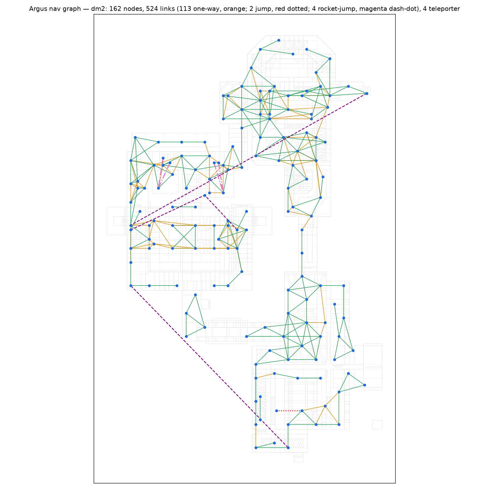
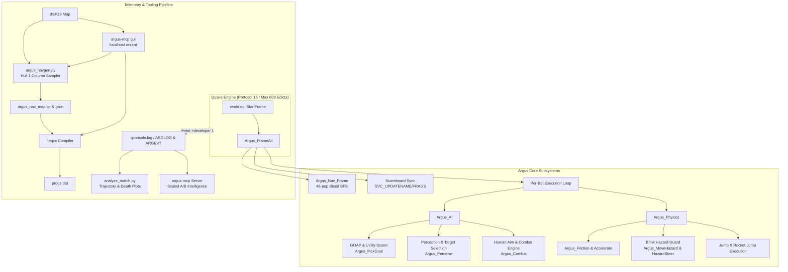
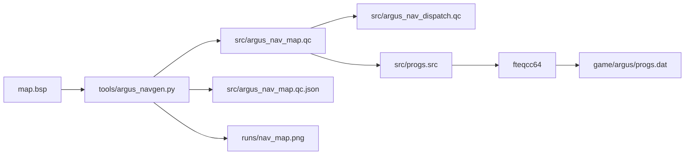

# Argus — Vanilla QuakeC deathmatch bot and telemetry laboratory

[](https://github.com/saworbit/argus/actions/workflows/compile.yml)

Argus is an advanced deathmatch bot for Quake 1 built in pure vanilla QuakeC. It runs on classic NetQuake protocol 15 with a strict 600-edict ceiling, requires zero engine extensions or file I/O, and is compatible with any standard Quake engine (QuakeSpasm, Ironwail, vkQuake, FTEQW, DarkPlaces, or the official 2021 rerelease).

The bot combines the spiritual lineage of the **Reaper Bot** (1996) and **Omicron Bot** (1997) with a modern, closed-loop telemetry and analysis pipeline. Every subsystem — from movement physics and hazard avoidance to Goal-Oriented Action Planning (GOAP) and humanized aim tracking — is tuned from empirical match telemetry.



---

## System architecture



---

## Core features

### 1. Locomotion and physical simulation
- **Player physics emulation**: Custom friction, ground acceleration, and air acceleration executed per server frame in `StartFrame`.
- **Decoupled movement and aim headings**: The bot's movement direction (`ar_moveyaw`) is fully decoupled from its facing angle (`angles_y`), enabling circle-strafing during combat.
- **Apex cornering lookahead**: Slices corners by evaluating line-of-sight to the waypoint after next (`nx`) when within 112 units of the current node, eliminating rigid waypoint pivoting.
- **Plat-state-aware elevator handling**: Reads the `func_plat` state machine before waiting — steps out from under a raised slab (a moving bot in the shaft volume postpones the descent on every touch), stands motionless so the descent delay can expire, and boards a resting slab so its own approach summons the ride with it aboard.
- **Train riding**: Boards patrolling `func_train` cars by steering onto the slab itself, zeroes velocity to ride standing still, and walks off at the far dock — bots cross dm2's moving-platform bridge at deck height.
- **Grate-floor and steep-stair walking**: Retries refused steps under `FL_PARTIALGROUND` (id's own escape hatch for the engine's point-traced ledge guard), so decorative floors with recessed channels and 45-degree strip stairs walk at full run speed instead of pinning the bot.

### 2. Predictive hazard avoidance
- **280u brink probes**: `Argus_MoveHazard` casts downward traces 32u–48u ahead along movement vectors, detecting `CONTENT_LAVA`, `CONTENT_SLIME`, or fatal floor drops before the bot steps over the edge.
- **Hull-bridge discrimination**: A liquid floor under the probe point is only a real hazard if the whole 32x32 hull would stand in it — `Argus_HazardBridge` requires solid banks on both sides within a bridgeable span, so decorative lava channels narrower than the player bbox read as floor while pool rims keep the conservative veto.
- **Staircase rescue**: A probe buried inside rising geometry re-checks from knee-plus height; a clear window landing on a walkable tread means stairs (walkmove climbs the risers one at a time), while walls and true pits stay vetoed.
- **Deflection hysteresis**: `Argus_HazardSteer` tests alternate headings in priority fans (+50, -50, +100, -100, 180 degrees) and locks onto `ar_hazardyaw` with angular memory to prevent corner oscillation.
- **Safe line floor validation**: `Argus_SafeLine` samples floor collision every 48 units along direct item sightlines, preventing bots from plunging into pits to reach visible items.

### 3. Combat, perception, and humanized aim
- **Damped-spring aim model**: Second-order yaw tracking with per-skill spring constants — flick, slight overshoot, settle, tremor — plus configurable reaction latency (`ar_reactbase`) and an aim error cone that narrows over continuous tracking duration.
- **Simulated hearing and investigation**: `W_Attack` broadcasts gunfire to every bot within 1000u (wall-damped); an unengaged bot glances at fresh sounds, and nearby fire pulls it toward the fight instead of past it.
- **Combat memory and grudges**: A recent foe stays re-acquirable at 360 degrees for 5 seconds (no forgetting mid-dodge), and three consecutive deaths to one player raise a vendetta bounty on them.
- **Ballistic compensation**: Applies parabolic loft compensation for Grenade Launcher trajectories, downward pitch adjustments for Rocket Launcher fire from elevated walkways, and feet-aim against grounded targets for splash.
- **Continuous fire button hold**: Automatically asserts `button0 = 1` within 12 degrees of target alignment, ensuring continuous-fire weapon frame chains (Lightning Gun, Super Nailgun) maintain active beams without resetting animations.
- **Dynamic weapon selection**: Selects optimal weapons based on distance thresholds, owned inventory, waterlevel safety, and remaining ammunition reserves.

### 4. Goal selection and GOAP planning
- **Dynamic item utility scoring**: Scores all live trigger items on the map based on personality appetites, missing health/armour deltas, weapon tiers, and distance attenuation (`score = value * 320 / (dist + 160)`).
- **Pack dispersion**: Items targeted by fellow bots receive an automatic 40% score reduction to spread the squad across the arena.
- **Loot economy**: Dropped backpacks are valued by their contents (a fat rocket pack outranks most weapons), a fresh kill-drop carries a time-critical urgency bonus while the victim is still respawning, and a kill immediately re-shops the killer's goals — looting your victim is the loop humans run by reflex.
- **Denial and control loops**: An opponent standing near an item makes taking it sweeter, and an owned Rocket Launcher or Lightning Gun stays worth a refill-and-denial swing past its spawn.
- **Prerequisite goal planning**: Utilises a lightweight Goal-Oriented Action Planning (GOAP) bitmask (`AR_WS_ARMED`, `AR_WS_STOCKED`, `AR_WS_HEALTHY`, `AR_WS_ARMORED`). If a high-value powerup (Quad/Pent) is selected while unarmed, the planner prepends fetching a weapon first.

### 5. Multi-map frame-sliced navigation
- **Sliced BFS router**: Breadth-first graph search slices expansions across server frames (48 node pops per frame via `ANQ_POPS`), avoiding runaway CPU limits.
- **Route generation stamping**: Next-hop waypoint pointers (`an_next0..3`) are stamped with a route generation counter (`ar_routegen`), invalidating stale pointers if a bot is knocked off course.
- **Typed link execution**: Supports walk links, one-way drop links, parabolic jump links (`an_jumpmask`), rocket-jump links (`an_rjmask`), elevator links (`an_liftmask`), swim-exit links (`an_swimmask`), train rides (`an_trainmask`), and door passages (`an_doormask`).
- **Door and button handling**: Touch-open doors are walked through (the classname masquerade fires their triggers), button-only doors detour to their button and hold for the slab when the door is near, and shoot-actuated plates are fired at with the bot's own aimed attack.

### 6. Personalities and scoreboard integration
- **Personality matrix** (keyed on roster slot, so renaming bots never changes how they play):
  - **Slot 0 — the flick** (Carmack): Aggressive, impatient, weapon-first focus, rapid trigger response.
  - **Slot 1 — the smooth operator** (Romero): Tactical, health and armour prioritisation, smooth tracking aim.
  - **Slots 2–3 — the glory hounds** (Joe Rogan, and the `impulse 100` fourth bot): Powerup-focused, aggressive rocket jumps, wildest aim.
  - Chat voices are name-keyed on top — the 18-character homage roster below each speak in their own voice.
- **Scoreboard illusion**: Injects `SVC_UPDATENAME`, `SVC_UPDATECOLORS`, and `SVC_UPDATEFRAGS` into spare client slots (`argus_maxclients - 1 - slot`), displaying full names, colours, and frags on the `TAB` scoreboard.

---

## Repository layout

```
argus/
|-- game/
|   `-- argus/                 # Shippable mod folder (copy next to id1/)
|       |-- progs.dat          # Compiled QuakeC binary
|       `-- autoexec.cfg       # Enforces sv_protocol 15 and max_edicts 600
|-- src/                       # Complete QuakeC source code (GPL 1.06 base)
|   |-- argus.qc               # Bot AI, physics, combat, perception, GOAP
|   |-- argus_nav.qc           # Runtime sliced BFS router and link execution
|   |-- argus_nav_dispatch.qc  # Map navigation dispatch table
|   |-- argus_nav_<map>.qc     # Per-map compiled waypoint graphs (generated)
|   |-- defs.qc                # Global definitions, bot flags, builtin shims
|   |-- items.qc               # Item touch modifications (ar_isbot awareness)
|   |-- combat.qc              # Damage calculations and knockback momentum
|   `-- progs.src              # fteqcc compilation manifest
|-- tools/
|   |-- argus_navgen.py        # Offline BSP29 navigation compiler (Hull 1 sampler)
|   |-- analyze_match.py       # Trajectory visualizer and A/B comparative plotter
|   |-- pak_extract.py         # Standalone id1 PAK archive reader / extractor
|   |-- mdl_skins.py           # Palette-remapped player MDL skin injector
|   |-- setup_rig.sh           # Automated headless Linux environment setup
|   `-- argus_mcp/             # Lab MCP (stdio) plus `argus-mcp gui` wizard
|-- runs/                      # Archive of telemetry logs and trajectory plots
|-- backups/                   # Dated progs + nav copies (machine-local, not in repo)
`-- docs/                      # Architectural specifications and design records
```

*(The working tree also carries machine-local lab configuration — agent briefs, MCP wiring, engine installs, and licensed id assets — which is deliberately excluded from this repository.)*

---

## Quick start

### 1. Installation
1. Copy the `game/argus` directory into your Quake installation folder (alongside `id1`).
2. Launch Quake with `-game argus`:

```bash
# QuakeSpasm / Ironwail / vkQuake
quakespasm -game argus +deathmatch 1 +map dm4

# Official 2021 Rerelease (KEX Engine)
Quake_Shipping_Steam.exe -game argus +deathmatch 1 +map dm4
```

3. Three bots (**Carmack**, **Romero**, and **Joe Rogan**) spawn immediately and begin fighting. Press `TAB` to see their names and scores on the scoreboard.

### 2. In-game console controls, spectator camera & chat Easter eggs

| Command / Impulse | Action |
|---|---|
| `impulse 210` | **Toggle ArgusCam Spectator Mode** on / off. |
| `impulse 211` / `Mouse 1` | **Cycle Camera Mode**: POV -> Smart Chase -> AI Director -> Duel Focus -> FreeLook Flight -> Orbit. |
| `impulse 212` / `Mouse 2` | **Cycle Target Bot**: Carmack -> Romero -> Joe Rogan -> Trent Reznor -> American McGee -> Sarge -> Thresh -> Killcreek -> Sandy Petersen -> Gabe Newell -> Crash -> Ranger -> Tim Willits -> Reap -> Omi -> Zeus -> Ares. |
| `impulse 213` | **Toggle Chase Cam Framing**: Center over-head vs over-the-right-shoulder. |
| `impulse 214` | **Toggle Broadcast HUD Overlay**: Bot health, armour, weapon, frags, and affect state. |
| `impulse 220` | **Chat Easter Egg**: Speak to John Carmack (*Engine architecture & frame budgets*). |
| `impulse 221` | **Chat Easter Egg**: Speak to John Romero (*Pure Deathmatch & rocket mastery*). |
| `impulse 222` | **Chat Easter Egg**: Speak to Joe Rogan (*T1 line in 1999, DMT & electron butterflies*). |
| `impulse 223` | **Chat Easter Egg**: Speak to Mr Elusive (*AAS navigation & fuzzy logic AI*). |
| `impulse 224` | **Chat Easter Egg**: Speak to Dennis "Thresh" Fong (*Red armor control & item clocks*). |
| `impulse 226` | **Chat Easter Egg**: Speak to Trent Reznor (*Industrial soundscapes & Super Nailguns*). |
| `impulse 227` | **Chat Easter Egg**: Speak to American McGee (*Labyrinth architecture & gothic traps*). |
| `impulse 228` | **Chat Easter Egg**: Speak to Sarge (*Buckshot, cigar smoke & combat tactics*). |
| `impulse 229` | **Chat Easter Egg**: Speak to Gabe Newell (*Steam summer sale & engine polish*). |
| `impulse 230` | **Chat Easter Egg**: Speak to Stevie "Killcreek" Case (*Lightning Gun shaft precision*). |
| `impulse 225` | **Chat Easter Egg**: Arena Shout (*"Good game everyone!"*). |
| `skill 0` to `skill 3` | Adjusts bot difficulty dial (reaction delay, aim error, tracking rate) on next respawn. |
| `impulse 100` | Adds an extra bot from the homage roster (up to 4 bots total). |
| `impulse 102` | Removes the most recently spawned bot from the arena. |
| `fraglimit <n>` | Sets match frag limit; game transitions levels upon a bot reaching the target. |
| `timelimit <n>` | Sets match time limit in minutes. |

---

### 3. Homage bot roster & chat personalities

Argus includes an extensive 18-character homage roster celebrating Quake history with distinct voice lines and event-driven chat behaviors:

* **Carmack**: Direct, hyper-analytical, latency and cache-line focused (*"In the information age, the barriers just aren't there"*, *"Fast inverse square root: calculated directly"*, *"Rocket splash radius is O(1)"*).
* **Romero**: High swagger, rockstar energy, creator of deathmatch (*"To win the game you must kill me, John Romero!"*, *"You're about to become my bitch!"*, *"The rocket launcher is a musical instrument"*).
* **Mr Elusive**: Bot AI pioneer, AAS navigation mesh and fuzzy logic evaluator (*"AAS navigation mesh loaded"*, *"Your path traversal had a 0% survival probability"*, *"Fuzzy logic evaluation: Target eliminated"*).
* **Joe Rogan**: Avid 90s Quake DM veteran (*"I had a T1 line installed in my house in 1999 just to play Quake"*, *"We are giving birth to the electron butterfly!"*, *"Jamie, pull that frag up!"*, *"Pure ape violence!"*).
* **Trent Reznor**: Industrial maestro & Quake composer (*"Head like a hole, black as your soul. Welcome to the machine"*, *"Nine Inch Nails straight through the chest"*, *"I hurt myself today... to see if I still feel"*).
* **American McGee**: Twisted architect of classic deathmatch maps (*"Welcome to my labyrinth. Mind the drop"*, *"Designed this room specifically for your execution"*, *"Mad as a hatter! QUAD ACTIVE!"*).
* **Sarge**: Cigar-chomping grizzled marine veteran (*"Lock and load, maggots! Sarge is in the house"*, *"Eat buckshot, boy!"*, *"I love the smell of burning rockets in the morning"*).
* **Thresh**: First Quake world champion and master of item clocks (*"Controlling red armor. 30 seconds to Quad"*, *"Keys to the Ferrari 328 secured"*, *"Map control wins games"*).
* **Killcreek**: Legendary champion and Lightning Gun pioneer (*"Ready to show the boys how Quake is played"*, *"Fried by the shaft!"*, *"Nobody beats Killcreek in the rematch!"*).
* **Sandy Petersen**: Eldritch horror architect (*"Ph'nglui mglw'nafh Cthulhu R'lyeh wgah'nagl fhtagn"*, *"Sacrificed to Shub-Niggurath!"*, *"That is not dead which can eternal lie..."*).
* **Gabe Newell**: Valve founder & engine licensing pioneer (*"Welcome to the Steam tournament. Worth the weight"*, *"Your life has been discounted by 75%!"*, *"Praise Lord Gaben! QUAD POWER!"*).
* **Crash**: Quake 3 drill mentor (*"Back to the respawn queue, rookie!"*, *"Keep your crosshair up!"*).
* **Ranger**: Slipgate marine veteran (*"Through the Slipgate once more"*, *"Telefragged across four dimensions!"*).
* **Tim Willits**: Arena flow and corridor master (*"Flow is everything. Keep moving"*, *"Speed, flow, and verticality"*).
* **Reap & Omi**: The legendary Reaper and Omicron bot souls (*"reap is here. start running"*, *"omi online. calculating"*).
* **Zeus & Ares**: Thunderous combat gladiators.

---

### 4. ArgusCam spectator modalities

```
+---------------------------------------------------------------------------------------------------------+
|                                        ARGUSCAM MODALITY MATRIX                                         |
+---------------------------------------------------------------------------------------------------------+
| Mode 0: BOT POV         -> True 1st-person view with viewmodel sync, exact aim pitch, & HUD mirroring  |
| Mode 1: SMART CHASE     -> 3rd-person spring-damped camera with velocity lead & anti-clip wall hugging  |
| Mode 2: AI DIRECTOR     -> Autonomous broadcast camera with action scoring, kill-cams, & tele cuts      |
| Mode 3: FOCUS / DUEL    -> Dynamic two-player midpoint framing keeping both dueling bots in camera FOV  |
| Mode 4: FREELOOK DRONE  -> 6DOF inertial noclip flight camera with acceleration damping & turbo cruise  |
| Mode 5: ORBIT / SHOWCASE-> Smooth sinusoidal orbital track around victorious bots or Quad spawns        |
+---------------------------------------------------------------------------------------------------------+
```

* **Critically Damped Anti-Clip**: 5-Ray pentagonal collision probing (center, top $+14\text{z}$, bottom $-10\text{z}$, left $-12\text{y}$, right $+12\text{y}$) that pulls inward instantaneously to eliminate wall clipping and smoothly expands outward once clear.
* **Kill Cam Auto-Focus**: The AI Director automatically switches focus to the killer upon target death to capture victory celebrations and powerup claims.
* **Teleporter Cut-Ahead**: Detects when a tracked bot approaches a `trigger_teleport` and pre-positions the camera at the exit arch for seamless broadcast TV cuts.
* **Cartographer Vantage Anchors**: Utilises pre-calculated elevated arena nodes emitted by `tools/argus_navgen.py` to frame multi-level combat arenas.
* **Full HUD & Viewmodel Mirroring**: Mode 0 renders the target bot's active weapon viewmodel and synchronises health, armour, and ammo counts to the engine's native status bar.
* **Debounced Mouse Navigation**: Left Click (`button0`) cycles modes, Right Click (`button2`) cycles targets, and holding `Shift` activates turbo flight ($1400\text{u/s}$) in FreeLook mode.


---

## Supported maps

| Map | File | Waypoints | Key features & Link types |
|---|---|---|---|
| **The Bad Place** | `dm4` | 145 nodes | Walkway hazard steering, rocket-jump Quad ledge link, stitched pit-escape links, stair drop-links. |
| **Claustrophobopolis** | `dm2` | 162 nodes | Corridor-sampled graph: 2 elevator platforms, 3 patrolling trains (the upper-deck bridge is ridden), 25 typed door links, prize rocket-jump pads. |
| **The Abandoned Base** | `dm3` | 190 nodes | Multi-level platform tower, elevator padding, water trench swim-exit links. |
| **The Dark Zone** | `dm6` | 153 nodes | Multi-tier central arena, teleporter loops, drop-links. |
| **LibreQuake DM2** | `lqdm2` | 197 nodes | Stand-in testing arena for automated headless validation. |

*Note: On maps without compiled navigation files, bots automatically degrade to line-of-sight seeking and direct combat.*

---

## Compiling navigation for custom maps

The navigation pipeline converts standard Quake `.bsp` files directly into collision-verified QuakeC waypoint graphs without requiring in-game recording.



### Compilation steps
1. Extract or place your target `.bsp` file in your workspace.
2. Run the navigation compiler:

```bash
python tools/argus_navgen.py maps/dm1.bsp dm1 src/argus_nav_dm1.qc runs/nav_dm1.png --no-dispatcher
```

3. Register the new map in `src/argus_nav_dispatch.qc`:
```c
else if (mapname == "dm1")
    Argus_Nav_Spawn_dm1 ();
```
4. Add `argus_nav_dm1.qc` into `src/progs.src` before `argus_nav_dispatch.qc`.
5. Compile the QuakeC source using `fteqcc`:
```bash
cd src
fteqcc64
cp ../lq1/progs.dat ../game/argus/progs.dat
```

### Visualising navigation graphs
The generated PNG output (`runs/nav_<map>.png`) provides an immediate visual health check:
- **Green lines**: Bidirectional walkable connections.
- **Orange lines**: One-way drops (19–200 units).
- **Red dotted lines**: Gap jump links (parabolic trajectory verified).
- **Magenta dash-dot lines**: Rocket-jump links.
- **Cyan lines**: Elevator / plat links.
- **Purple dashed lines**: Teleporter connections.

---

## Telemetry and match analysis

Argus outputs high-frequency telemetry via `dprint` during matches.

### Capturing match logs
Launch your engine with `-condebug` and `+developer 1`:
```bash
quakespasm -game argus -dedicated 8 +developer 1 +deathmatch 1 +map dm4
```

### Parsing and plotting trajectories
Run `analyze_match.py` to generate 2D trajectory overlays on top of the BSP wireframe:

```bash
# Single match trajectory view
python tools/analyze_match.py maps/dm4.bsp qconsole.log runs/match_traj.png src/argus_nav_dm4.qc.json

# Comparative A/B run panel
python tools/analyze_match.py maps/dm4.bsp runs/ab_dm4_A.log runs/ab_dm4_B.log runs/compare.png
```

```
+-----------------------------------------------------------------------------------+
| TELEMETRY GRAMMAR SPECIFICATION                                                   |
+-----------------------------------------------------------------------------------+
| ARGLOG <name> t <t> pos '<x y z>' spd <u/s> yaw <deg> mode <m>                    |
|        st <stalls> gl <goals> hp <health> frg <frags>                             |
|                                                                                   |
| ARGEVT <name> spawned | respawn | goal <class> | route <hops> | routefail |       |
|        abandon | stall | stallnode '<x y z>' | trapped | jump | rjump | lift |    |
|        swim | door | train | hazard | engage <enemy> | pursue |                   |
|        weapon <axe|sg|ssg|ng|sng|gl|rl|lg> | plan <want> via <step> |             |
|        death <killer> pos '<x y z>'                                               |
+-----------------------------------------------------------------------------------+
```

---

## The lab MCP server and deploy wizard

Current version **0.18**. Operator guide: [`tools/argus_mcp/README.md`](tools/argus_mcp/README.md).

The Rust binary in `tools/argus_mcp/` is two faces of the same lab:

- **stdio MCP** (`argus-mcp`) for agents: compile, cartograph, headless match, A/B.
- **localhost GUI** (`argus-mcp gui`) for humans: attach a `.bsp`, generate nav, view the nav PNG, compile, install, restore a dated backup.

```bash
# agent (this is what Grok / Claude should call)
argus-mcp

# human wizard, binds 127.0.0.1:7420 and opens the browser
argus-mcp gui
argus-mcp gui --port 7420 --no-open
```

### Key MCP tools
- `see what=project`: Active tree, maps, and the next call.
- `see what=map name=dm4`: Cartographer brief (control items, islands, door cuts, corridor misses, edict estimate).
- `see what=path name=dm4:quad->lg`: Waypoint BFS including walk/drop/jump/tele/rocket/lift/swim.
- `experiment map=dm4 duration_sec=30 skill=2`: Compile, short match, duration-scaled lite A/B.
- `compare_runs log_a=baseline log_b=latest`: Unscaled A/B against the shipped tape.
- `learn_hotspots map=dm4`: Fold stall/lava/hazard cells; writes `src/argus_nav_<map>.costs.json` for the next navgen.

Lava deaths in experiment/compare are hull-0 contents (same as `analyze_match.py`). `z < -300` is only used when the BSP is missing. dm2 baseline is `ab_dm2_lava`.

---

## Technical constraints and engine quirks

1. **Classname Masquerade**: Bots spawn with `classname = "player"` so standard Quake 1.06 item pickups, triggers, doors, and obituaries accept them without modifying base entity logic.
2. **Client-Message Shimming**: In [`src/defs.qc`](src/defs.qc), `stuffcmd`, `sprint`, and `centerprint` are intercepted with `if (client.ar_isbot) return;` because native Quake engines crash when client-channel network commands are dispatched to non-network entities.
3. **Empty Server Telemetry**: Native Quake `bprint` broadcasts are suppressed on dedicated servers without human clients. All Argus telemetry utilizes `dprint` and requires `+developer 1` to be written to `qconsole.log`.
4. **Protocol 15 and Edict Budget**: Configured in `game/argus/autoexec.cfg` with `sv_protocol 15` and `max_edicts 600`. The navigation generator automatically lowers waypoint node caps if map entity counts approach the allocation ceiling.

---

## License

The QuakeC game mod (`src/`, `game/`) is licensed under the GNU General Public License v2 ([LICENSE](LICENSE)), matching the original 1996 Quake 1.06 source code and LibreQuake base it derives from. The Python tooling, documentation, and the Rust lab MCP server are provided under the MIT License ([LICENSE-MIT](LICENSE-MIT)).
