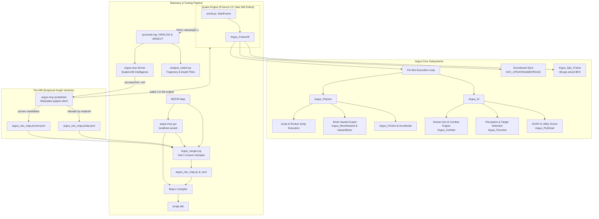
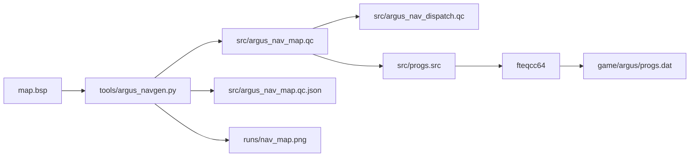

# Argus - Vanilla QuakeC deathmatch bot and telemetry laboratory

[](https://github.com/saworbit/argus/actions/workflows/compile.yml)
[](https://github.com/saworbit/argus/discussions)
[](LICENSE)
[](LICENSE-MIT)
[](CODE_OF_CONDUCT.md)

Argus is an advanced deathmatch bot for Quake 1 built in pure vanilla QuakeC. It runs on classic NetQuake protocol 15 with a strict 600-edict ceiling, requires zero engine extensions or file I/O, and is compatible with any standard Quake engine (QuakeSpasm, Ironwail, vkQuake, FTEQW, DarkPlaces, or the official 2021 rerelease).

The bot combines the spiritual lineage of the **Reaper Bot** (1996) and **Omicron Bot** (1997) with a modern, closed-loop telemetry and analysis pipeline. Every subsystem - from movement physics and hazard avoidance to Goal-Oriented Action Planning (GOAP) and humanized aim tracking - is tuned from empirical match telemetry.


---

## System architecture



---

## Core features

### 1. Locomotion and physical simulation
- **Player physics emulation**: Custom friction, ground acceleration, and air acceleration executed per server frame in `StartFrame`.
- **Decoupled movement and aim headings**: The bot's movement direction (`ar_moveyaw`) is fully decoupled from its facing angle (`angles_y`), enabling circle-strafing during combat.
- **Apex cornering lookahead**: Slices corners by evaluating line-of-sight to the waypoint after next (`nx`) when within 112 units of the current node, eliminating rigid waypoint pivoting.
- **Plat-state-aware elevator handling**: Reads the `func_plat` state machine before waiting - steps out from under a raised slab (a moving bot in the shaft volume postpones the descent on every touch), stands motionless so the descent delay can expire, and boards a resting slab so its own approach summons the ride with it aboard.
- **Train riding**: Boards patrolling `func_train` cars by steering onto the slab itself, zeroes velocity to ride standing still, and walks off at the far dock - bots cross dm2's moving-platform bridge at deck height.
- **Grate-floor and steep-stair walking**: Retries refused steps under `FL_PARTIALGROUND` (id's own escape hatch for the engine's point-traced ledge guard), so decorative floors with recessed channels and 45-degree strip stairs walk at full run speed instead of pinning the bot.
- **Predictive gap jumping**: At a vetoed brink in unrouted movement, the bot simulates the jump it could make right now - 0.1 s parabola segments traced for collisions - and takes it only when the landing is a dry floor within survivable range ("only if satisfied with the result", after the 1998 Omicron design).
- **Router-promised drops**: A routed bot whose next waypoint sits far below on a legal sub-200u drop commits with one firm step off the lip instead of teetering at the edge the engine refuses to walk over.
- **Sprint-jump run-up discipline**: Trick-jump links that demand full run speed are staged like a human takes them - walk to a validated run-up point behind the launch seat on the extended jump line, charge through the seat at the landing, fire at the last unit of ledge, and hold the flight line against mid-air distractions for the whole arc. Launches print `ARGUS <name> sprintjump`.
- **Frame-rate-independent swimming**: Swim drag and thrust are expressed per second rather than per frame. Terminal speed was never the issue (the drag scales with the impulse, so it settles at 300 u/s on any tick rate) but the *time constant* was frame-counted, and the two rates that matter are far apart: the headless lab server runs at `frametime 0.1` - id's `host_frametime` clamp, about 10 frames a second - while a listen server runs near 72. Bots therefore swam roughly seven times more responsively in a played session than in any recorded match. The model is now calibrated against the measured lab rate and identical at both.
- **Combat-yielding mover waits**: Pad-side lift and train holds release the moment an enemy engages - the bot fights with full movement and resumes the wait afterwards, so a queued bot is never a free frag.

### 2. Predictive hazard avoidance
- **280u brink probes**: `Argus_MoveHazard` casts downward traces 32u-52u ahead along movement vectors (probe distance scales with speed, so a sprinting bot sees the pit in time), detecting `CONTENT_LAVA`, `CONTENT_SLIME`, or fatal floor drops before the bot steps over the edge.
- **Hull-bridge discrimination**: A liquid floor under the probe point is only a real hazard if the whole 32x32 hull would stand in it - `Argus_HazardBridge` requires solid banks on both sides within a bridgeable span, so decorative lava channels narrower than the player bbox read as floor while pool rims keep the conservative veto.
- **Staircase rescue**: A probe buried inside rising geometry re-checks from knee-plus height; a clear window landing on a walkable tread means stairs (walkmove climbs the risers one at a time), while walls and true pits stay vetoed.
- **Deflection hysteresis**: `Argus_HazardSteer` tests alternate headings in priority fans (+50, -50, +100, -100, 180 degrees) and locks onto `ar_hazardyaw` with angular memory to prevent corner oscillation.
- **Safe line floor validation**: `Argus_SafeLine` samples floor collision every 48 units along direct item sightlines, preventing bots from plunging into pits to reach visible items. It shares the staircase rescue above, because a downward trace that *starts* inside solid geometry returns the same result as one that finds nothing at all - rising ground and a bottomless void are indistinguishable unless you test for it explicitly.

### 3. Combat, perception, and humanized aim
- **Damped-spring aim model with saccade glide**: Second-order yaw tracking with per-skill spring constants - flick, slight overshoot, settle, tremor - plus configurable reaction latency (`ar_reactbase`) and an aim error cone that narrows over continuous tracking duration. The held error offset re-rolls every 0.25-0.55 s and *ramps* to its new value over 0.15 s instead of stepping, so the spring never chases a teleporting target - a human wrist drifts between corrections.
- **Simulated hearing and investigation**: `W_Attack` broadcasts gunfire to every bot within 1000u (wall-damped, listened for at chest height so flat corridors are not mistaken for walls); an unengaged bot glances at fresh sounds - as a rate-limited head turn, not a one-frame snap - and nearby fire pulls it toward the fight instead of past it.
- **Horizontal field of view**: The soft FOV gate on new distant targets measures *bearing*, projecting the target onto the horizontal plane first. Normalising in three dimensions and dotting against a flat forward vector charges the target for its height, which blinds a bot to an opponent standing on a walkway directly in front of it.
- **Combat memory and grudges**: A recent foe stays re-acquirable at 360 degrees for 5 seconds (no forgetting mid-dodge), and three consecutive deaths to one player raise a vendetta bounty on them. The grudge is vented only by killing *that* player - the bot tracks who it actually killed, from the human obituary path as well as its own, so it cannot taunt its nemesis over an uninvolved third party's body.
- **Ballistic compensation**: Grenade loft is derived from the launcher rather than tuned by hand - `W_FireGrenade` throws at `v_forward * 600 + v_up * 200`, so over a flight `t = d/600` the net vertical travel is `200t - 400t^2` and the aim correction is its negative, `d*d/900 - d/3`. Rocket fire from elevated walkways pitches down so the shot clears the lip, projectile lead is clamped to the floor beneath a falling target (a full vertical lead aims through the world), and grounded targets are shot at the feet for splash.
- **Continuous fire button hold**: Automatically asserts `button0 = 1` within 12 degrees of target alignment, ensuring continuous-fire weapon frame chains (Lightning Gun, Super Nailgun) maintain active beams without resetting animations.
- **Dynamic weapon selection**: Selects optimal weapons based on distance thresholds, owned inventory, waterlevel safety, and remaining ammunition reserves. Holding nothing but a loaded Rocket Launcher at close range, a bot fires it from 120u out on a stack of 100 or more rather than charging with the axe - and below that distance it really does take the axe, because splash is `120 - dist/2` and the trade stops paying.
- **Missile dodging**: Scans for inbound rockets and grenades every 0.15 s and commits to a perpendicular sidestep that is checked for both floor *and* clearance, shooting throughout. Floor alone is not enough: a wall has excellent floor under it, and dodging into one pins the bot exactly where the rocket is going. Serial rockets still land sometimes at every skill tier to stay human.
- **Retreat by geometry**: A low-stack bot against a healthy enemy fans headings away from the threat and commits to the first whose destination breaks the enemy's line of sight - cover is a wall between us, never distance. Cornered means fight; the bot shoots the whole way out.
- **Mid-fight item grabs**: Combat sweeps 240u for worthwhile live items every half second and bends the strafe circle toward the best for one short commit - a wounded bot steps onto the health box between rockets instead of strafing past it.
- **Weapon-sound classification and pickup hearing**: The listener knows *what* it heard - heavy gunfire on a thin health stack keeps its distance while a healthy bot hunts the big fight, and weapon, armour, powerup, megahealth, and backpack pickups are audible intel that starts the denial loop.
- **Theory of mind - the hunch and the ambush reflexes**: When a chase goes cold, the bot scores the map *as its opponent* (their health, their guns) and bets on the item they are running for; during pursuit it pre-fires one speculative rocket at the corner they vanished behind; and after a kill it bets on where the victim will respawn and shops toward it for a short window. That last bet now respects the engine's own spawn rule - `SelectSpawnPoint` skips any pad with a player within 84 units, so the pad nearest the body (where the killer is standing) is the one it is *least* likely to pick. Interception emerges from the same utility scorer that runs the circuits.

### 4. Goal selection and GOAP planning
- **Dynamic item utility scoring**: Scores all live trigger items on the map based on personality appetites, missing health/armour deltas, weapon tiers, and distance attenuation (`score = value * 320 / (dist + 160)`).
- **Control circuits**: Major items (unowned RL/LG, fresh armours, megahealth, powerups, fat packs) read distance at 0.4x, so the far prizes pull from across the map - bots run the arm/deny/hunt rotation between control points instead of grazing whatever is near.
- **Item respawn clocks and pre-positioning**: A consumed item's respawn timer is readable in pure vanilla QC (`SUB_regen` nextthink), so bots time their arrivals - up to 10 seconds early at a discount - and orbit the spawn point in camping laps until it pops. Be early, not on time.
- **Island discipline**: Two consecutive route failures from one spot narrow the shopping list to the nearest live item until a route completes, so a bot on a disconnected map region grinds local errands instead of suiciding out.
- **Pack dispersion**: Items targeted by fellow bots receive an automatic 40% score reduction to spread the squad across the arena.
- **Loot economy**: Dropped backpacks are valued by what the bot can actually *absorb* (a 40-rocket pack is worth nothing to a bot already at 100) and a pack carrying a gun the bot does not own is priced as the weapon it is, not as a garnish. A fresh kill-drop carries a time-critical urgency bonus while the victim is still respawning, and a kill immediately re-shops the killer's goals - looting your victim is the loop humans run by reflex.
- **Armour tiers, not armour points**: `armor_touch` replaces rather than accumulates, so a lower tier is a downgrade in absorption even when the arithmetic looks positive - red armour worn down to 37 units is 29.6 effective points against green's 30. Bots refuse to shop below the tier they are wearing instead of trading 80% absorption for 30%.
- **Denial and control loops**: An opponent standing near an item makes taking it sweeter, and an owned Rocket Launcher or Lightning Gun stays worth a refill-and-denial swing past its spawn.
- **Prerequisite goal planning**: Utilises a lightweight Goal-Oriented Action Planning (GOAP) bitmask (`AR_WS_ARMED`, `AR_WS_STOCKED`, `AR_WS_HEALTHY`, `AR_WS_ARMORED`). If a high-value powerup (Quad/Pent) is selected while unarmed, the planner prepends fetching a weapon first.

### 5. Multi-map frame-sliced navigation
- **Sliced BFS router**: Breadth-first graph search slices expansions across server frames (48 node pops per frame via `ANQ_POPS`), avoiding runaway CPU limits.
- **Route generation stamping**: Next-hop waypoint pointers (`an_next0..3`) are stamped with a route generation counter (`ar_routegen`), invalidating stale pointers if a bot is knocked off course.
- **Shared route cache**: A completed route is stamped into shared per-node cache fields; any bot wanting the same goal from a node on that fresh path adopts the chain instantly - no search frames, no router contention - after re-checking the rocket-jump toll per hop.
- **Corridor sampling and stair-run seats**: The nav compiler samples fine (16u) for connectivity while seating coarse for the edict budget, and detects rising stair runs to promote seats at their bottom, top, and midpoint - the narrow passages and staircases a 32u grid never stands in.
- **Typed link execution**: Supports walk links, one-way drop links, parabolic jump links (`an_jumpmask`), rocket-jump links (`an_rjmask`), sprint-jump links (full-run-speed arcs, skill-gated), elevator links (`an_liftmask`), swim-exit and dive links (`an_swimmask`), train rides (`an_trainmask`), and door passages (`an_doormask`).
- **Engine-verdict graph refinement (the mill)**: The lab's puppet client walks accused links in the real engine; refuted walk links whose centre-line void fits the jump envelope are reminted as jump links, unjumpable refusals die, and candidate entries the puppet *proves* are minted from `argus_nav_<map>.proven.json`. Every chronic stall cell fixed this way stays fixed - the engine testifies, navgen re-types, bots inherit.
- **Door and button handling**: Touch-open doors are walked through (the classname masquerade fires their triggers), button-only doors detour to their button and hold for the slab when the door is near, and shoot-actuated plates are fired at with the bot's own aimed attack.

### 6. Personalities and scoreboard integration
- **Personality matrix** (keyed on roster slot, so renaming bots never changes how they play):
  - **Slot 0 - the flick** (Carmack): Aggressive, impatient, weapon-first focus, rapid trigger response.
  - **Slot 1 - the smooth operator** (Romero): Tactical, health and armour prioritisation, smooth tracking aim.
  - **Slots 2-3 - the glory hounds** (Joe Rogan, and Mr Elusive as the `impulse 100` fourth bot): Powerup-focused, aggressive rocket jumps, wildest aim.
  - Chat voices are name-keyed on top - the 18-character homage roster below each speak in their own voice.
- **Skill scales the neck as well as the trigger**: `ar_aimrate` (170 deg/s at skill 0 rising to 300 at skill 3, with a personality offset) drives pursuit corner turns and auditory glances, not just aim tracking - a warmup bot looks around more slowly than a skill 3 bot, rather than merely shooting worse.
- **Audible powerup tells**: Bots play the stock three-second expiry cues for quad, pentagram, ring and biosuit, so a player fighting a powered-up opponent can hear the multiplier about to lapse. Information the code had and the human did not.
- **Scoreboard illusion**: Injects `SVC_UPDATENAME`, `SVC_UPDATECOLORS`, and `SVC_UPDATEFRAGS` into spare client slots (`argus_maxclients - 1 - slot`), displaying full names, colours, and frags on the `TAB` scoreboard.

---

## Repository layout

```
argus/
|-- game/
|   `-- argus/                 # Shippable mod folder (copy next to id1/)
|       |-- progs.dat          # Compiled QuakeC binary
|       `-- autoexec.cfg       # Enforces sv_protocol 15 and max_edicts 600
|-- src/                       # Complete QuakeC source code (GPL 1.06 base)
|   |-- argus.qc               # Bot AI, physics, combat, perception, GOAP
|   |-- argus_cam.qc           # ArgusCam spectator camera and broadcast director
|   |-- argus_nav.qc           # Runtime sliced BFS router and link execution
|   |-- argus_nav_dispatch.qc  # Map navigation dispatch table
|   |-- argus_nav_<map>.qc     # Per-map compiled waypoint graphs (generated)
|   |-- argus_nav_<map>.qc.json    # Machine-readable twin of each graph
|   |-- argus_nav_<map>.probe.json # Puppet-sweep link convictions (by endpoint)
|   |-- argus_nav_<map>.proven.json# Engine-proven candidate entries (7g2d input)
|   |-- defs.qc                # Global definitions, bot flags, builtin shims
|   |-- items.qc               # Item touch modifications (ar_isbot awareness)
|   |-- combat.qc              # Damage calculations and knockback momentum
|   `-- progs.src              # fteqcc compilation manifest
|-- tools/
|   |-- argus_navgen.py        # Offline BSP29 navigation compiler (Hull 1 sampler)
|   |-- analyze_match.py       # Trajectory visualizer and A/B comparative plotter
|   |-- argus_review.py        # Tape review battery (summary, deaths, regions, rides)
|   |-- argus_reach.py         # Directed-reach audit of the shipped nav graphs
|   |-- harvest_session.py     # Stamps a play session's tape + demo into runs/
|   |-- pak_extract.py         # Standalone id1 PAK archive reader / extractor
|   |-- mdl_skins.py           # Palette-remapped player MDL skin injector
|   |-- setup_rig.sh           # Automated headless Linux environment setup
|   `-- argus_mcp/             # Lab MCP (stdio), `argus-mcp gui`, puppet client, probelinks
|-- runs/                      # Archive of telemetry logs and trajectory plots
|   `-- demos/                 # Paired .dem recordings (machine-local, not in repo)
|-- backups/                   # Dated progs + nav copies (machine-local, not in repo)
|-- CHANGELOG.md               # Distilled build history, v3.1 to current
`-- docs/                      # Architectural specifications and design records
```

*(The working tree also carries machine-local lab configuration - agent briefs, MCP wiring, engine installs, and licensed id assets - which is deliberately excluded from this repository.)*

---

## Quick start

### 1. Installation
1. Copy the `game/argus` directory into your Quake installation folder (alongside `id1`).
2. Launch Quake with `-game argus`:

```bash
# QuakeSpasm / Ironwail / vkQuake
quakespasm -game argus +deathmatch 1 +map dm4

# Official 2021 Rerelease (KEX engine) - note the + form: KEX ignores
# classic -game, but honours the console command from the launch line.
# The mod folder lives in "Saved Games\Nightdive Studios\Quake\argus".
quake_x64_steam.exe +game argus +deathmatch 1 +map dm4
```

On KEX, bot skins work through a deliberate fallback: the remaster's
MD5 player model only defines skin 0, so the engine logs
`Missing skin for progs/player (skin# 1..4). MDL will be enforced`
and renders the classic colour-baked MDL for exactly the bot skins
while humans keep the remaster model.

3. Three bots (**Carmack**, **Romero**, and **Joe Rogan**) spawn immediately and begin fighting. Press `TAB` to see their names and scores on the scoreboard.

### 2. In-game console controls, spectator camera & chat Easter eggs

| Command / Impulse | Action |
|---|---|
| `impulse 210` | **Toggle ArgusCam Spectator Mode** on / off. |
| `impulse 211` / `Mouse 1` | **Cycle Camera Mode**: POV -> Smart Chase -> AI Director -> Duel Focus -> FreeLook Flight -> Orbit. |
| `impulse 212` / `Mouse 2` | **Cycle Target Bot**: Carmack -> Romero -> Joe Rogan -> Trent Reznor -> American McGee -> Sarge -> Thresh -> Killcreek -> Sandy Petersen -> Gabe Newell -> Crash -> Ranger -> Tim Willits -> Reap -> Omi -> Zeus -> Ares. |
| `impulse 213` | **Toggle Chase Cam Framing**: Center over-head vs over-the-right-shoulder. |
| `impulse 214` | **Toggle Broadcast HUD Overlay**: Bot health, armour, weapon, frags, and affect state. |
| `impulse 220` | **Chat Easter Egg**: Speak to John Carmack (*Engine architecture & frame budgets*). |
| `impulse 221` | **Chat Easter Egg**: Speak to John Romero (*Pure Deathmatch & rocket mastery*). |
| `impulse 222` | **Chat Easter Egg**: Speak to Joe Rogan (*T1 line in 1999, DMT & electron butterflies*). |
| `impulse 223` | **Chat Easter Egg**: Speak to Mr Elusive (*AAS navigation & fuzzy logic AI*). |
| `impulse 224` | **Chat Easter Egg**: Speak to Dennis "Thresh" Fong (*Red armor control & item clocks*). |
| `impulse 226` | **Chat Easter Egg**: Speak to Trent Reznor (*Industrial soundscapes & Super Nailguns*). |
| `impulse 227` | **Chat Easter Egg**: Speak to American McGee (*Labyrinth architecture & gothic traps*). |
| `impulse 228` | **Chat Easter Egg**: Speak to Sarge (*Buckshot, cigar smoke & combat tactics*). |
| `impulse 229` | **Chat Easter Egg**: Speak to Gabe Newell (*Steam summer sale & engine polish*). |
| `impulse 230` | **Chat Easter Egg**: Speak to Stevie "Killcreek" Case (*Lightning Gun shaft precision*). |
| `impulse 225` | **Chat Easter Egg**: Arena Shout (*"Good game everyone!"*). |
| `skill 0` to `skill 3` | Adjusts bot difficulty dial (reaction delay, aim error, tracking rate) on next respawn. |
| `impulse 100` | Opens interactive in-game bot roster control menu. |
| `impulse 101` | Adds an extra bot from the homage roster (up to 4 bots total). |
| `impulse 102` | Removes the most recently spawned bot from the arena. |
| `impulse 103` | Cycles bot difficulty skill (0..3: Easy, Normal, Medium, Hard). |
| `impulse 104` | Toggles ArgusCam AI spectator director. |
| `impulse 105` | Displays match statistics and bot scorecards. |
| `fraglimit <n>` | Sets match frag limit; game transitions levels upon a bot reaching the target. |
| `timelimit <n>` | Sets match time limit in minutes. |

> The table is not the whole list. Argus descends from two bots, and
> the elder of the pair claimed its console word the only way vanilla
> QuakeC ever could - by handing the client an alias on the way in.
> Argus hands you the same one, on the same impulse number. Say the
> ancestor's name in the console and see who answers.

---

### 3. Homage bot roster & chat personalities

Argus includes an extensive 18-character homage roster celebrating Quake history with distinct voice lines and event-driven chat behaviors:

* **Carmack**: Direct, hyper-analytical, latency and cache-line focused (*"In the information age, the barriers just aren't there"*, *"Fast inverse square root: calculated directly"*, *"Rocket splash radius is O(1)"*).
* **Romero**: High swagger, rockstar energy, creator of deathmatch (*"To win the game you must kill me, John Romero!"*, *"You're about to become my bitch!"*, *"The rocket launcher is a musical instrument"*).
* **Mr Elusive**: Bot AI pioneer, AAS navigation mesh and fuzzy logic evaluator (*"AAS navigation mesh loaded"*, *"Your path traversal had a 0% survival probability"*, *"Fuzzy logic evaluation: Target eliminated"*).
* **Joe Rogan**: Avid 90s Quake DM veteran (*"I had a T1 line installed in my house in 1999 just to play Quake"*, *"We are giving birth to the electron butterfly!"*, *"Jamie, pull that frag up!"*, *"Pure ape violence!"*).
* **Trent Reznor**: Industrial maestro & Quake composer (*"Head like a hole, black as your soul. Welcome to the machine"*, *"Nine Inch Nails straight through the chest"*, *"I hurt myself today... to see if I still feel"*).
* **American McGee**: Twisted architect of classic deathmatch maps (*"Welcome to my labyrinth. Mind the drop"*, *"Designed this room specifically for your execution"*, *"Mad as a hatter! QUAD ACTIVE!"*).
* **Sarge**: Cigar-chomping grizzled marine veteran (*"Lock and load, maggots! Sarge is in the house"*, *"Eat buckshot, boy!"*, *"I love the smell of burning rockets in the morning"*).
* **Thresh**: First Quake world champion and master of item clocks (*"Controlling red armor. 30 seconds to Quad"*, *"Keys to the Ferrari 328 secured"*, *"Map control wins games"*).
* **Killcreek**: Legendary champion and Lightning Gun pioneer (*"Ready to show the boys how Quake is played"*, *"Fried by the shaft!"*, *"Nobody beats Killcreek in the rematch!"*).
* **Sandy Petersen**: Eldritch horror architect (*"Ph'nglui mglw'nafh Cthulhu R'lyeh wgah'nagl fhtagn"*, *"Sacrificed to Shub-Niggurath!"*, *"That is not dead which can eternal lie..."*).
* **Gabe Newell**: Valve founder & engine licensing pioneer (*"Welcome to the Steam tournament. Worth the weight"*, *"Your life has been discounted by 75%!"*, *"Praise Lord Gaben! QUAD POWER!"*).
* **Crash**: Quake 3 drill mentor (*"Back to the respawn queue, rookie!"*, *"Keep your crosshair up!"*).
* **Ranger**: Slipgate marine veteran (*"Through the Slipgate once more"*, *"Telefragged across four dimensions!"*).
* **Tim Willits**: Arena flow and corridor master (*"Flow is everything. Keep moving"*, *"Speed, flow, and verticality"*).
* **Reap & Omi**: The legendary Reaper and Omicron bot souls (*"reap is here. start running"*, *"omi online. calculating"*).
* **Zeus & Ares**: Thunderous combat gladiators.

---

### 4. ArgusCam spectator modalities

```
+---------------------------------------------------------------------------------------------------------+
|                                        ARGUSCAM MODALITY MATRIX                                         |
+---------------------------------------------------------------------------------------------------------+
| Mode 0: BOT POV         -> True 1st-person view with viewmodel sync, exact aim pitch, & HUD mirroring  |
| Mode 1: SMART CHASE     -> 3rd-person spring-damped camera with velocity lead & anti-clip wall hugging  |
| Mode 2: AI DIRECTOR     -> Autonomous broadcast camera with action scoring, kill-cams, & tele cuts      |
| Mode 3: FOCUS / DUEL    -> Dynamic two-player midpoint framing keeping both dueling bots in camera FOV  |
| Mode 4: FREELOOK DRONE  -> 6DOF inertial noclip flight camera with acceleration damping & turbo cruise  |
| Mode 5: ORBIT / SHOWCASE-> Smooth sinusoidal orbital track around victorious bots or Quad spawns        |
+---------------------------------------------------------------------------------------------------------+
```

* **Critically Damped Anti-Clip**: 5-Ray pentagonal collision probing (center, top $+14\text{z}$, bottom $-10\text{z}$, left $-12\text{y}$, right $+12\text{y}$) that pulls inward instantaneously to eliminate wall clipping and smoothly expands outward once clear.
* **Kill Cam Auto-Focus**: The AI Director automatically switches focus to the killer upon target death to capture victory celebrations and powerup claims.
* **Teleporter Cut-Ahead**: Detects when a tracked bot enters a `trigger_teleport` volume - testing the brush bounds the engine tests, not a radius around its centre, which a wide trigger defeats - and pre-positions the camera at the exit arch for seamless broadcast TV cuts.
* **Cartographer Vantage Anchors**: Utilises pre-calculated elevated arena nodes emitted by `tools/argus_navgen.py` to frame multi-level combat arenas.
* **Full HUD & Viewmodel Mirroring**: Mode 0 renders the target bot's active weapon viewmodel - including its firing animation frames - and synchronises health, armour, and ammo counts to the engine's native status bar. The broadcast HUD names the tracked bot, its weapon, and its behavioural state (`QUAD SPREE`, `PANICKED`, `COMBAT`, `ROUTING`, `TACTICAL`).
* **Correct view pitch**: Camera look vectors flip the sign that `vectoangles()` returns, because the builtin reports upward elevation as positive pitch while the view-angle protocol wants up negative. Every framing mode applies it, so cuts are not composed upside down vertically.
* **Live POV facing**: First-person mode takes yaw from the bot's continuously-maintained facing and pitch only while it is actually aiming at something, rather than from an aim angle that goes stale the moment a fight ends.
* **Debounced Mouse Navigation**: Left Click (`button0`) cycles modes, Right Click (`button2`) cycles targets, and holding `Shift` activates turbo flight ($1400\text{u/s}$) in FreeLook mode.


---

## Supported maps

| Map | File | Waypoints | Directed reach | Key features & Link types |
|---|---|---|---|---|
| **The Bad Place** | `dm4` | 155 nodes | 98% | Walkway hazard steering, rocket-jump Quad ledge pads, sprint-jump links in the quad corridor, stitched pit-escape links. |
| **Claustrophobopolis** | `dm2` | 216 nodes | 99% | Reborn graph: guaranteed control-item seats, jump stitches, 2 elevators with outside-the-shaft boarding pads, 3 patrolling trains (the upper-deck bridge is ridden both ways), typed door links, engine-convicted grate-room links reminted as jumps. |
| **The Abandoned Base** | `dm3` | 259 nodes | 86% | Corridor-sampled with stair-run seats, multi-level platform tower, water trench swim and dive links, the engine-proven RL-islet entry. The west-wing red armour is the one prize still stranded (its entrance needs corridor-campaign seats). |
| **The Dark Zone** | `dm6` | 213 nodes | 94% | Reborn graph, teleporter loops, sprint links, full puppet-sweep verdicts on file. |
| **LibreQuake DM2** | `lqdm2` | 214 nodes | 97% | Reborn on the modern pipeline; the CI stability-smoke arena. |

Every walk link in the dm2/dm3/dm6 rotation has been empirically
verified by the lab's puppet client walking it in the real engine;
the standing convictions live in `src/argus_nav_<map>.probe.json`
and feed each map's next verdict regen.

*Note: On maps without compiled navigation files, bots automatically degrade to line-of-sight seeking and direct combat.*

---

## Compiling navigation for custom maps

The navigation pipeline converts standard Quake `.bsp` files directly into collision-verified QuakeC waypoint graphs without requiring in-game recording.



### Compilation steps
1. Extract or place your target `.bsp` file in your workspace.
2. Run the navigation compiler:

```bash
python tools/argus_navgen.py maps/dm1.bsp dm1 src/argus_nav_dm1.qc runs/nav_dm1.png --no-dispatcher
```

3. Register the new map in `src/argus_nav_dispatch.qc`:
```c
else if (mapname == "dm1")
    Argus_Nav_Spawn_dm1 ();
```
4. Add `argus_nav_dm1.qc` into `src/progs.src` before `argus_nav_dispatch.qc`.
5. Compile the QuakeC source using `fteqcc`:
```bash
cd src
fteqcc64
cp ../lq1/progs.dat ../game/argus/progs.dat
```

### Visualising navigation graphs
The generated PNG output (`runs/nav_<map>.png`) provides an immediate visual health check:
- **Green lines**: Bidirectional walkable connections.
- **Orange lines**: One-way drops (19-200 units).
- **Red dotted lines**: Gap jump links (parabolic trajectory verified).
- **Magenta dash-dot lines**: Rocket-jump links.
- **Cyan lines**: Elevator / plat links.
- **Purple dashed lines**: Teleporter connections.

---

## Telemetry and match analysis

Argus outputs high-frequency telemetry via `dprint` during matches.

### Capturing match logs
Launch your engine with `-condebug` and `+developer 1`:
```bash
quakespasm -game argus -dedicated 8 +developer 1 +deathmatch 1 +map dm4
```

### Parsing and plotting trajectories
Run `analyze_match.py` to generate 2D trajectory overlays on top of the BSP wireframe:

```bash
# Single match trajectory view
python tools/analyze_match.py maps/dm4.bsp qconsole.log runs/match_traj.png src/argus_nav_dm4.qc.json

# Comparative A/B run panel
python tools/analyze_match.py maps/dm4.bsp runs/ab_dm4_A.log runs/ab_dm4_B.log runs/compare.png
```

```
+-----------------------------------------------------------------------------------+
| TELEMETRY GRAMMAR SPECIFICATION                                                   |
+-----------------------------------------------------------------------------------+
| ARGLOG <name> t <t> pos '<x y z>' spd <u/s> yaw <deg> mode <m>                    |
|        st <stalls> gl <goals> hp <health> frg <frags>                             |
|                                                                                   |
| ARGEVT <name> spawned | respawn | goal <class> | route <hops> | routefail |       |
|        abandon | stall | stallnode '<x y z>' | trapped | jump | rjump | lift |    |
|        swim | door | train | board | hazard | engage <enemy> | pursue |           |
|        retreat | grab <class> | weapon <axe|sg|ssg|ng|sng|gl|rl|lg> |             |
|        plan <want> via <step> | death <killer> pos '<x y z>'                      |
|                                                                                   |
| Side channels (outside the closed ARGEVT vocabulary, counted as                   |
| pseudo-events by the lab): "ARGUS <name> shove", "ARGUS routecache               |
| adopt", "ARGUS <name> hunch <class>", "ARGUS <name> prefire",                     |
| "ARGUS <name> watch spawn", "ARGUS <name> sprintjump".                            |
| Debug channel (console `scratch1 1`, never in briefs):                            |
| ARGDBG <name> pick <class> u <utility> | <per-class scores> ...                   |
+-----------------------------------------------------------------------------------+
```

Human clients emit the same `ARGLOG` track under their own netname
(camera flights excluded), so every analysis tool sees the human
player as one more trajectory - the reference circuit the bots are
measured against. Real-client deaths emit the same detailed
`ARGEVT death` line as bots, and the parsers split human tracks out
of the bot quality bands automatically.

### Recording and reading demos
The 1 Hz telemetry tape is the ruler; a `.dem` recording is the
microscope. Demos carry full-rate positions for every visible entity
(25-70 Hz), projectiles in flight, view angles, and the console kill
feed. A listen session records one automatically by using the
`record` form of the map command:

```bash
quakespasm -listen 8 -condebug -game argus +developer 1 +deathmatch 1 +record session dm4
```

After playing, `python tools/harvest_session.py --tag v373` stamps
the tape and its demo into `runs/` under one paired stem, and
`see what=demo name=<stem>` in the lab parses the recording:
duration, named roster (bot identities resolve from the skin byte),
per-track sample rates and distances, and the coalesced obituary
feed. One physical caveat: demos are PVS-culled to the recording
client's view, so a bot across the map drops to a trickle - the
telemetry tape remains the full-map record and the A/B gates.

---

## The lab MCP server and deploy wizard

Current version **0.24**. Operator guide (with the full lab flow
charts): [`tools/argus_mcp/README.md`](tools/argus_mcp/README.md).

The Rust binary in `tools/argus_mcp/` is four instruments in one lab:

- **stdio MCP** (`argus-mcp`) for agents: compile, cartograph, headless match, A/B.
- **localhost GUI** (`argus-mcp gui`) for humans: attach a `.bsp`, generate nav, view the nav PNG, compile, install, restore a dated backup.
- **puppet client** (`argus-mcp client observe|walk|walkrel|impulse`): a real NetQuake protocol-15 client, invisible to the bots, used for live observation, roster control, and as the engine's own referee.
- **the mill** (`argus-mcp probelinks <map> [limit] [skip]`): walks every nav link with the puppet in the real engine and persists refusals by endpoint - the empirical verdicts that navgen remints into jump links or prunes on the next regen.

```bash
# agent (this is what Grok / Claude should call)
argus-mcp

# human wizard, binds 127.0.0.1:7420 and opens the browser
argus-mcp gui
argus-mcp gui --port 7420 --no-open
```

### Key MCP tools
- `see what=project`: Active tree, maps, and the next call.
- `see what=map name=dm4`: Cartographer brief (control items, islands, door cuts, corridor misses, plat boardability, edict estimate).
- `see what=path name=dm4:quad->lg`: Waypoint BFS including walk/drop/jump/tele/rocket/lift/swim.
- `see what=demo name=<stem>`: Parse a harvested `.dem` - full-rate named tracks, per-player aim statistics, a highlight reel with `playdemo` timestamps, projectiles, kill feed. `:export` writes the full track vectors as JSON. Also available as the CLI verb `argus-mcp demo <stem>`.
- `experiment map=dm4 duration_sec=30 skill=2`: Compile, short match, duration-scaled lite A/B.
- `compare_runs log_a=baseline log_b=latest`: Unscaled A/B against the shipped tape.
- `learn_hotspots map=dm4`: Fold stall/lava/hazard cells (kind-aware); writes `src/argus_nav_<map>.costs.json` for the next navgen.
- `tune command="skill 3"` - live console injection into the running dedicated child (works on Windows via `AttachConsole` + `CONIN$`, integration-tested). `scratch1 1` arms the **decision tape**: every bot goal pick prints its full per-class utility board as an `ARGDBG` line, so "why did it choose that" is a grep.

Two CLI modes serve the unattended lab, both bounded by hard caps and never scheduled by anything: `argus-mcp soak` (a match loop with gated verdicts and an incremental report; wall-clock, match-count and bytes-written caps, plus a stop file) and `argus-mcp cycle <map>` (one guarded learning pass - fold hotspots, regenerate the nav, compile, probe - that adopts only on an improved verdict and otherwise restores every file byte for byte).

Lava deaths in experiment/compare are hull-0 contents (same as `analyze_match.py`); `z < -300` is only used when the BSP is missing. Statue freezes are a hard A/B gate (6 s+ under 20 u/s, with an under-fire measure for damage taken while frozen), and lift/train boarding success is accounted (`mover_waits` vs `boards`) so a broken pad reads as broken rather than slow. A/B baselines are config-driven via `runs/baselines.json`.

Match briefs also cross-examine themselves: every stall/freeze/hazard hotspot carries a geometric `cause` from the atlas (door, plat column, lava edge); routefail clusters carry the directed reach of their nearest node and are flagged as **directed sinks** when the graph, not the walking, is at fault; atlas reach labels are checked against actual routing evidence; graph coverage reports nodes with no traffic and typed-link families that never fired; per-prize item-clock `tightness` measures how tightly the roster runs each respawn clock; human tracks are reported separately from the bot bands; and a tape whose requested map failed to spawn flags itself as describing the wrong map.

---

## Technical constraints and engine quirks

1. **Classname Masquerade**: Bots spawn with `classname = "player"` so standard Quake 1.06 item pickups, triggers, doors, and obituaries accept them without modifying base entity logic.
2. **Client-Message Shimming**: In [`src/defs.qc`](src/defs.qc), `stuffcmd`, `sprint`, and `centerprint` are intercepted with `if (client.ar_isbot) return;` because native Quake engines crash when client-channel network commands are dispatched to non-network entities.
3. **Empty Server Telemetry**: Native Quake `bprint` broadcasts are suppressed on dedicated servers without human clients. All Argus telemetry utilizes `dprint` and requires `+developer 1` to be written to `qconsole.log`.
4. **Protocol 15 and Edict Budget**: Configured in `game/argus/autoexec.cfg` with `sv_protocol 15` and `max_edicts 600`. The navigation generator automatically lowers waypoint node caps if map entity counts approach the allocation ceiling.
5. **Traces That Start In Solid**: A `traceline` beginning inside geometry returns `trace_fraction == 1` (with `trace_allsolid`), which is byte-identical to finding nothing at all. Every "is there floor here" probe must distinguish the two explicitly or it will read rising ground as a bottomless pit - and, in the other direction, `CanDamage` returning TRUE on such a trace is why rocket splash does *not* silently fail against a wall-adjacent target.
6. **Per-Frame Constants Are Tick-Rate Bugs**: Physics written as `v = v * k + impulse` per frame behaves differently at different tick rates. Terminal values usually survive (the drag scales with the impulse) but time constants do not, so behaviour tuned in one place can differ from behaviour in another. Express drag and thrust per second against `frametime` - and **measure the rate before calibrating to it**. The headless lab server here runs at `frametime 0.1`, which is id's `host_frametime` clamp rather than `sys_ticrate`, roughly ten frames a second, while a listen server runs near 72: a factor of seven between where the bot is measured and where it is played.
7. **`vectoangles()` Pitch Sign**: The builtin reports upward elevation as *positive* pitch; the view-angle protocol (`v_angle`, a spectator's `angles`) wants up as *negative*. Every conversion needs the flip, or the resulting view is vertically inverted.

---

## Community and contributing

Contributions, discussions, and match feedback are warmly welcome! Whether you are interested in bot AI, map navigation, physics tuning, or telemetry tooling:

- Join our **[GitHub Discussions](https://github.com/saworbit/argus/discussions)** for general chat, Q&A, feature ideas, and match clips.
- Check out the **[Contributing Guide](CONTRIBUTING.md)** for setup instructions, QuakeC constraints, and engineering guidelines.
- Review our **[Code of Conduct](CODE_OF_CONDUCT.md)** for community standards.
- Need help or troubleshooting tips? See **[Support](SUPPORT.md)**.
- For security questions or vulnerability reports, refer to the **[Security Policy](SECURITY.md)**.

---

## License

The QuakeC game mod (`src/`, `game/`) is licensed under the GNU General Public License v2 ([LICENSE](LICENSE)), matching the original 1996 Quake 1.06 source code and LibreQuake base it derives from. The Python tooling, documentation, and the Rust lab MCP server are provided under the MIT License ([LICENSE-MIT](LICENSE-MIT)).
