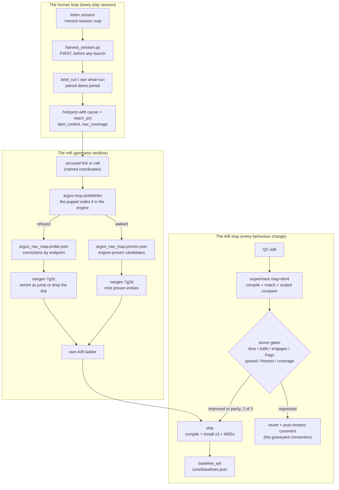

# Argus lab MCP server

Rust stdio MCP server for the Argus lab. It compiles QuakeC, ingests
maps, runs headless matches, and briefs the result the way this
project already judges A/B. Toolchain only: it does not change QuakeC
or the engine.

Current version: see `Cargo.toml`, the source of truth. Operator guide
(this file). Design history: `docs/specs/2026-08-17-argus-mcp-design.md`.
Captured external spec and triage: `docs/mcp_quake_dev_spec.md`.

```
cargo test --manifest-path tools/argus_mcp/Cargo.toml
cargo install --locked --path tools/argus_mcp --root tools/argus_mcp/install
```

Binary: `tools/argus_mcp/install/bin/argus-mcp` (`.exe` on Windows).
Point the client at this installed binary so startup is not a cargo build and
`cargo clean` cannot delete the configured server. Rerun the install command to
update it, then restart the client.

For a config saved before the stable install was documented, run this after
the install:

```
python tools/migrate_mcp_config.py
```

The command checks the known Codex, Grok and project config paths. Pass one or
more TOML or JSON paths to check only those files. It changes only the `argus`
entry when its command exactly ends in the retired
`tools/argus_mcp/target/release/argus-mcp` path, refuses an absent installed
binary, reparses the saved file to verify every other setting, and tells you to
restart the client. Existing environment and timeout values stay unchanged.

The running process locks the exe on Windows. To build an update without
stopping the client, stage it instead:

```
cargo build --release --manifest-path tools/argus_mcp/Cargo.toml --target-dir tools/argus_mcp/target-stage
```

On the next client restart, the installed binary uses `ARGUS_ROOT` to find the
stage and swaps it into place. Do not commit `target*/` or `install/`.

## Human deploy wizard

Same binary, not MCP. Design:
`docs/specs/2026-08-18-argus-lab-gui-design.md`.

```
argus-mcp gui
argus-mcp gui --port 7420 --no-open
```

Binds `127.0.0.1` only (never a public interface) and opens a
browser. One page:

- path strip (repo root, Quake basedir, game dir) for this process
- map list from `list_maps` (bsp / pak / nav / dispatcher flags)
- drop a `.bsp` into `maps_local/` (BSP29 check; simple names only)
- **Generate nav** (first registration waits for current reach and mill evidence)
- **Compile and install** (backup first, then `compile_qc`)
- **A/B quality gates** (evaluates candidate runs against baseline and renders visual gate cards)
- **Backup only** / **Restore**

After generate it shows the full edict-budget and playability verdicts,
`runs/nav_<map>.png`, and the 0.17 cartographer brief (islands, door
cuts, corridor misses, edicts). An over-budget run stops before
registration. A new map without current reach and engine evidence is
labelled `experimental`; generation still writes its QC, JSON, and PNG so the
mill can inspect it.
Id maps stay on this machine; the wizard will not pack them.

Compile always writes `$ARGUS_ROOT/backups/<YYYYMMDD-HHMMSS>/`:
`lq1/progs.dat`, each install `progs.dat` (lab basedir, `game/argus`,
and the rerelease Saved Games copy if that folder exists),
`src/progs.src`, `src/argus_nav_dispatch.qc`, every
`src/argus_nav_*.qc`, plus `manifest.json`. Restore copies those
files back. `backups/` is gitignored.

Agents keep using `see` / `experiment`. The GUI only buttons the
same functions.

## Developer CLI subcommands

The `argus-mcp` binary also acts as a unified CLI runner for the developer toolchain:

```
argus-mcp compile [--install] [--backup]
argus-mcp nav <map> [--register|--no-register]
argus-mcp analyze <log_path> [options]
argus-mcp harvest [--tag <name>]
argus-mcp reach [map]
argus-mcp measure [--write <path>]
```

- `compile`: Compiles QuakeC `progs.dat` via `fteqcc` with timestamp verification and optional backup creation and installation.
- `nav`: Runs `argus_navgen.py` to generate waypoint navigation graphs (`src/argus_nav_<map>.qc`) and minimap PNGs (`runs/nav_<map>.png`). First registration requires the current graph to pass reach and the mill.
- `analyze`: Runs `analyze_match.py` to parse telemetry logs into briefs, stats, and plots.
- `harvest`: Runs `harvest_session.py` to archive listen server logs and paired demos into `runs/`.
- `reach`: Runs `argus_reach.py` to audit directed item reachability for shipped navigation graphs.
- `measure`: The detection limit per map and metric over every committed same-build arm, and what four gates cost measured on the null corpus. Read-only. Writes `docs/specs/2026-09-16-lab-measurement-limits.md`.

## What it is for

An agent should not invent a shell pipeline of its own. This file is
the session protocol; a clone has no `AGENTS.md` or `CLAUDE.md`, both
are gitignored. The loop is:

1. `see what=project` (or open `argus://project`) for the tree, maps,
   and the next call.
2. `see what=map name=dm4` to ingest the BSP as a brief.
3. Look deeper without grepping: `see what=item name=dm4:quad`,
   `see what=path name=dm4:quad->lg`, `see what=search name=CONTENT_LAVA`,
   `see what=fn name=Argus_HazardSteer` (source plus calls and callers),
   `see what=plan name=latest` for GOAP plan events.
4. After a QC edit: `experiment map=dm4 duration_sec=30 skill=2`
   (compile + match + duration-scaled lite compare). Several maps:
   `matrix_experiment`.
5. `see what=last` for this process's last experiment. `tune
   command="skill 3"` then `see what=live` for a running child
   (Unix stdin; Windows console inject).

The long form (`compile_qc` → `match_run` → `compare_runs`) is still
there. Use it for a full-length, unscaled A/B (185 s vs the shipped
baseline). `experiment` is the one-call loop.

Read-only tools need only `ARGUS_ROOT`. Compile, navgen, and match
also need the compiler, engine, basedir, and Python.

## How the lab fits together

Four instruments feed one loop. The tape is the ruler, the demo is
the microscope, the puppet is the referee, and navgen is the pen
that writes what the referee decided back into the shipped graph.



The mill has killed every chronic stall cell it has been pointed at
(dm3 quad-court, dm2 grate room, dm3 RL islet). Its standing rule:
the engine testifies, navgen re-types, bots inherit - never knit or
delete blind.

## Config

No baked-in machine paths. Required for a full lab:

| Key | Meaning |
|-----|---------|
| `ARGUS_ROOT` | Repo root. Scripts live at `$ARGUS_ROOT/tools/`. |
| `ARGUS_FTEQCC` | Modern fteqcc executable. |
| `ARGUS_ENGINE` | Dedicated-capable Quake (QuakeSpasm in the lab). |
| `ARGUS_BASEDIR` | Engine `-basedir` (contains `id1/` and the game dir). |
| `ARGUS_PYTHON` | Python 3, used only for `argus_navgen.py` and `analyze_match.py`. |

Optional, with defaults under `ARGUS_ROOT`:

| Key | Default |
|-----|---------|
| `ARGUS_GAME` | `argus` |
| `ARGUS_SRC` | `$ARGUS_ROOT/src` |
| `ARGUS_RUNS` | `$ARGUS_ROOT/runs` |
| `ARGUS_PROGS` | `$ARGUS_ROOT/lq1/progs.dat` |
| `ARGUS_MAPS` | `$ARGUS_ROOT/maps_local` |

Load order: optional TOML, then env. Env wins. TOML path is
`$ARGUS_MCP_CONFIG`, else `$ARGUS_ROOT/tools/argus_mcp.toml`, else
`./tools/argus_mcp.toml`. If `ARGUS_ROOT` is still unset, the server
walks parents from the process cwd for `game/argus/autoexec.cfg` and
fills fteqcc / engine / basedir / python when those files exist in
the usual lab layout. Explicit env still wins.

`config_check` always returns the resolved table and never errors.
Other tools name the missing key and refuse.

Examples (fill real paths; do not commit secrets or this machine's
exe paths as if they were defaults): `tools/argus_mcp.toml.example`,
`.mcp.json.example`.

## Inspect (`see` and resources)

`see` is the one inspect call. Pass `what` and, when needed, `name`.
Omit `what` (or pass `start` / `orient`) for `project`. Aliases:
`qc`/`func` → `fn`, `atlas` → `map`, `session` → `last`,
`bots` → `live`, `route` → `path`, `grep`/`find` → `search`,
`pickup` → `item`, `events` → `timeline`, `near`/`pos` → `around`,
`goap`/`goalplan` → `plan`, `dem`/`replay` → `demo`.
`see what=help` prints the vocabulary.

Tool errors are JSON `{error, hint}` with a next call.

| `what` | `name` | Returns |
|--------|--------|---------|
| `project` | | Tree: QC files, maps, live vs compile, next call |
| `help` | | This vocabulary plus resource URIs |
| `lab` | | Dashboard: config, maps (bsp/nav/dispatcher), recent runs, recommend |
| `map` | `dm4` | Cartographer brief. `detail=full` for every entity |
| `recipe` | `dm4` | Just the match / compare line |
| `node` | `dm4:56` | Waypoint, out/in links (including rocket/lift/swim), nearby control |
| `path` | `dm4:56-72` or `dm4:quad->lg` | BFS on the inspect graph (walk/drop/jump/tele/rocket/lift/swim) |
| `item` | `dm4:quad` | Control item plus snapped node |
| `fn` | `Argus_HazardSteer` | Source, `calls`, `called_by` |
| `file` | `argus.qc:120-180` | A source slice |
| `search` | `CONTENT_LAVA` | Grep Argus QC (including items/combat/weapons) |
| `const` | `AR_JUMPVEL` | Matching `AR_*` constants |
| `live` | | Last ARGLOG sample per bot (running or last match) |
| `bot` | `Reap` or `latest:Reap` | Deep tape: events, deaths, nearest node/item, mode share |
| `timeline` | `Reap` or `ab_dm4_parity:Omi` | ARGEVT stream |
| `plan` | `latest` or `ab_dm4_goap4` | GOAP `ARGEVT plan <class> via <class>` |
| `around` | `dm4:200,-900,24` | Nearest node and control at a point |
| `status` | | Dedicated child: running, pid, elapsed. `since_line` for an incremental tail |
| `run` | `latest` or `ab_dm4_parity` | Lite brief of a harvested log |
| `demo` | `shane_dm4_2026-08-27_v373` | Parse a `.dem` from `runs/demos` or the game dir: duration, named roster, full-rate tracks, projectiles, kill feed |
| `last` | | Session memory: last map, function, run, experiment |
| `knobs` | | Live cvars vs compile-time constants |

Clients that speak MCP resources can open the same data without a
tool call:

| URI | Same as |
|-----|---------|
| `argus://project` | `see what=project` |
| `argus://lab` | `see what=lab` |
| `argus://knobs` | `see what=knobs` |
| `argus://last` | `see what=last` |
| `argus://quality` | `quality_bars` |
| `argus://help` | `see what=help` |
| `argus://map/{name}` | `see what=map name={name}` |
| `argus://fn/{name}` | `see what=fn name={name}` |
| `argus://run/{name}` | `see what=run name={name}` |
| `argus://const/{name}` | `see what=const name={name}` |
| `argus://path/{spec}` | `see what=path name={spec}` |
| `argus://search/{needle}` | `see what=search name={needle}` |
| `argus://graph-revisions/{map}` | Content-hash ids for current and committed nav JSON |
| `argus://graph/{map}/{hash}` | One exact `GraphRevision` with typed coordinate links |
| `argus://probe-verdicts/{map}/{hash}` | `ProbeVerdict` evidence beside that revision |

`see what=last` persists to `runs/.lab_session.json`, so it survives a
restart (0.21).

Graph ids are `map@md5`. The hash names the JSON bytes, while `commit` and
`committed_at` retain Git provenance. `mill what=revisions map=dm4` lists
them; `mill what=diff revision_a=dm4@... revision_b=dm4@...` reports added,
removed and type-changed links. Link ids use endpoint coordinates so node
renumbering does not fabricate a change. Passing `link=` narrows the result
and fails if that id occurs in neither graph. The resources and tool wrap the
existing `.qc.json`, `.probe.json`, `.proven.json`, `.costs.json` and
`.mined.json` files plus their Git history; they write nothing.

## Deeper inspect

These stay on `see`. They do not add tools.

**Nav path.** `name` is `map:from-to` or `map:from->to`. Each end is a
node id or a control-item token. Link kinds the inspect BFS walks:
`walk`, `drop` (one-way), `jump`, `tele`, `rocket`, `lift`, `swim`.
Item tokens:

| Token | Classname |
|-------|-----------|
| `quad` | `item_artifact_super_damage` |
| `lg` / `lightning` | `weapon_lightning` |
| `rl` / `rocket` | `weapon_rocketlauncher` |
| `gl` / `grenade` | `weapon_grenadelauncher` |
| `ssg` | `weapon_supershotgun` |
| `sng` | `weapon_supernailgun` |
| `ng` | `weapon_nailgun` |
| `pent` | `item_artifact_invulnerability` |
| `ring` | `item_artifact_invisibility` |
| `mega` / `mh` | `item_health` with spawnflags 2 (id MegaHealth) |
| `ya` / `yellow` | `item_armor2` |
| `ra` / `red` | `item_armorInv` |

A classname substring also matches. Off-graph items (`reach` is
`off_graph` with no `nearest_node`) cannot be a path end.
`rocket_jump` items still resolve if they snapped to a pad node.

**QC.** `see what=fn` indexes `argus.qc`, `argus_nav.qc`,
`argus_nav_dispatch.qc`, and the masquerade-touched base files
(`defs.qc`, `items.qc`, `combat.qc`, `weapons.qc`, `world.qc`,
`client.qc`). Extra names kept: `weapon_touch`, `T_Damage`,
`W_FireLightning`, `W_Attack`, `PlayerDie`, `CheckPowerups`,
`WaterMove`, `PlayerPostThink`. `search` greps those files (needle
at least two characters, 24 hits). `file` is `name.qc` (first 80
lines) or `name.qc:120-180`.

**Tape.** `see what=bot name=Reap` uses the live or last match log.
`name=latest:Reap` or `name=ab_dm4_parity:Omi` reads a harvested
log. The deep bot view adds last events, deaths, nearest node/item,
height band, and mode share. `timeline` is the ARGEVT stream (40
events). `around` is `map:x,y,z` (commas or spaces).

## Map ingest (cartographer)

`cartograph` is the BSP ingest. Pass a path, a short name (`dm4`), or
`maps/dm4.bsp`.

Order, first hit wins:

1. The path as given, if that file exists.
2. `$ARGUS_ROOT/<path>`.
3. `$ARGUS_MAPS/<name>` or `$ARGUS_MAPS/<name>.bsp`.
4. Extract `maps/<name>.bsp` from `id1/pak0.pak` then `pak1.pak` under
   `ARGUS_BASEDIR` (also `engine/id1` and `$ARGUS_ROOT/id1`) and write
   it into `maps_local/`.

Default output is `detail=brief` (what an LLM should read). It is
not a raw entity dump:

- **control** items ranked (LG, RL, quad, pent, mega, red armour)
- each snapped to a nav node (nearest hull-1-clear eye line among
  the eight closest, else Euclidean): `reach` is `walk`, `jump`
  (normal 45u), `rocket_jump` (beyond a jump), `elevator` (near a
  plat pad), `blocked_by_door` (segment hits a door AABB), or
  `off_graph`; `island` is the weak-component id
- **graph_cuts**: weak/strong component counts, top islands with
  which control items sit on each
- **door_cuts**: walk/drop links that pierce a door AABB, plus the
  button and actuator that open it
- **corridor_misses**: 16u standable cells with no waypoint in 48u
  (the 32u sampler never sat there)
- **edict estimate**: waypoint count plus entity lump, against
  vanilla `max_edicts 600`
- **height bands** from the waypoint graph (on dm4: walkway / mid /
  pit / deep)
- **recipe**: the next `experiment` / `match_run` line
- dispatcher coverage and implications

`reach=rocket_jump` means the nearest walk node sits too far below
the item for a normal jump. On dm4 the runtime pad is node 142 at
about `209 -183 -296` onto node 56 (the quad ledge). That is a
typed `Argus_NavLinkRocket`, not a parked idea. The inspect BFS
walks rocket, lift and swim edges as well as walk/drop/jump/tele,
so `see what=path name=dm4:quad->lg` can use the pad hop.

`detail=full` adds every entity, every teleporter, and button-door
causality (including one relay hop and `func_door_secret`). Atlases
and nav graphs cache until the BSP or nav JSON mtime changes.

`lab_status` lists maps with bsp / nav / dispatcher flags and a
recipe string. It does not ingest every BSP (that was 0.11). Use
`see what=map` or `cartograph` for a real brief. `cartograph_all`
still atlases every on-disk BSP.

`list_maps` lists `*.bsp` already in `ARGUS_MAPS` plus map names that
still live only inside the PAKs.

`generate_nav=true` on `cartograph` also runs `argus_navgen.py`
(`--no-dispatcher`, and `--register` by default so `progs.src` and
`argus_nav_dispatch.qc` are wired after the first-registration gate passes).
Pass `register=false` to generate an experimental graph before its reach and
mill passes.

A match brief attaches `goal_reach`: each goaled classname gets the
cartographer's `reach`.

## Demo ingest

The 1 Hz ARGLOG tape is the ruler and the gates; a `.dem` is the
microscope. A listen session records one with the map-taking form of
`record` in the launch command (`+record session dm4` - the bare
`+record name` form before a map connects records nothing), then
`python tools/harvest_session.py --tag vNNN` stamps the tape and
demo into `runs/` under one paired stem, map sniffed from the last
confirmed SpawnServer.

`see what=demo name=<stem>` parses it: protocol-15 block stream,
fast-update deltas against baselines, obituary fragments coalesced
into whole lines. Identity is structural: a real client is entity
1..maxclients (scoreboard row = entity - 1); a bot's skin byte is
its roster slot + 1 and its scoreboard row counts down from the
top, so every player-model track comes back named. Body-queue
corpses are tagged `body`; missile/grenade tracks are tagged
`projectile` (note: entity SLOTS recycle, so a projectile track is
a slot history - split on time gaps for true per-rocket arcs).

Caveats: demos are PVS-culled to the recording client's view (an
out-of-sight bot drops to a trickle - the first walkway-corner
forensics found its freeze happened entirely off-camera), and the
engine truncates `qconsole.log` in its working directory on launch -
HARVEST BEFORE STARTING ANYTHING NEW.

`argus-mcp demo <stem>[:export]` is the CLI face of the same reader,
for sessions without an MCP client.

The brief carries analysis, not just inventory: per-player `aim`
statistics (mean and p95 angular rate, flick count - the recording
client measured from full-precision POV angles, bots from their
entity angles), and a `highlights` reel (first blood, multikills,
sprees, quad pickups and carrier deaths, environment deaths) each
with a timestamp to jump to under `playdemo`. `see what=demo
name=<stem>:export` also writes `<stem>.tracks.json` (full t / pos /
pitch / yaw vectors plus the POV series) for offline studies - the
sprint run-up forensics input format.

## The puppet client (netclient)

`netclient.rs` is a real NetQuake protocol-15 client in Rust: the
CCREQ/CCREP control handshake, a reliable channel with per-packet
acks, `clc_move` at 20 Hz, and the full signon dance. It connects
as **labprobe**, a name `Argus_CanSee` refuses on principle - the
puppet is an instrument, invisible to every bot, the same courtesy
as the spectator camera.

```
argus-mcp client observe [secs] [host] [port]   connect, spawn, report the
                                                live world (roster, my_pos,
                                                entity flow)
argus-mcp client walk <x> <y> <z> [secs]        walk toward a point, with
                                                auto-hop on stagnation
                                                (clears steps, lips, jumps)
argus-mcp client walkrel <dx> <dy> [secs]       relative walk from spawn
argus-mcp client impulse <n> [secs]             fire a player impulse from
                                                the puppet's seat - 100 adds
                                                a bot (the headless 4-player
                                                match), 216 is the dev
                                                teleport probelinks uses
```

Windows gotcha, hard-won: WinQuake binds UDP 26000 to the
hostname-resolved address, not loopback - the client mirrors the
engine's lookup and locks onto whatever address answers.
Engine-spawning tests share a lock; a stale engine on 26000 makes
every connect fail, so kill orphans first.

## The mill (probelinks and the verdict files)

Empirical link verification - the killer app the netclient was
built for. Per walk link: spawn the lab engine at skill 0, connect
the puppet, dev-teleport it to the link's start (impulse 216 +
scratch cvars, one semicolon-joined inject), walk toward the far
node, judge arrival.

```
argus-mcp probelinks <map> [limit] [skip] [--coop] [--jumps]
                                                cap 80 per run; chunk with
                                                skip. ~2600 links/hour, so a
                                                full-rotation sweep is an
                                                evening, not an overnight
```

The default pass covers ordinary walk and drop links. `--jumps` covers the
generated jump subset. A community BSP found only in `ARGUS_MAPS` is copied
into the game directory for the pass and removed when the engine stops.

Failures persist by ENDPOINT COORDINATES (indices shift per regen)
in `src/argus_nav_<map>.probe.json`, merged across sweeps. The
output also counts `teleport_failures` - on teleporter maps the
puppet can step into a live mouth mid-walk and read as a distant
failure; triage convictions against the `trigger_teleport` AABBs
before trusting them (a walk line through a mouth is invalid for
bots too - `teleport_touch` is class-blind - but it is a different
defect than a void).

Each pass also records the MD5 of the exact graph it walked. First
registration accepts only matching deathmatch evidence for ordinary links and,
when the graph has them, generated jumps. A refused jump is stored separately
from walk convictions, removed on the next regen, and drawn as a dark red
dashed line with crossed endpoints in the debug PNG. Because that changes the
graph digest, run the short passes once more before registration.

Nav sidecar files, all consumed by `argus_navgen.py` on the next
regen of that map:

| File | Written by | Consumed by |
|---|---|---|
| `argus_nav_<map>.qc.json` | navgen | the whole lab (atlas, reach, probelinks) |
| `argus_nav_<map>.costs.json` | `learn_hotspots` | fine-edge cost inflation |
| `argus_nav_<map>.probe.json` | probelinks failures and graph-specific pass evidence | 7g2c verdict prune/remint plus first-registration gate |
| `argus_nav_<map>.proven.json` | candidate probe runs | 7g2d engine-proven entry mint |
| `argus_nav_<map>.candidates.json` / `.splice.json` | entry-candidate sessions | paper trail of how proven.json was derived |

Sweeping the whole rotation is a chunk loop: a detached driver
calling `probelinks` with advancing `skip`, honouring
`runs/soak.stop`, writing its position to
`runs/probe_soak_state.json`. Monitor the STATE FILE with one-shot
reads - never `tail -f` a log a PowerShell writer appends to
(MSYS tail blocks the appends silently, and killing the monitor
orphans the tail; this manufactured the "orphan handle" mystery
of 2026-08-28).

## Idle hands (soak and cycle)

Two CLI modes for the unattended lab. Neither is scheduled by
anything; they exist for the night the operator feels like it.

`argus-mcp soak` loops matches and gates every tape against the
shipped baseline, writing `runs/soak_<stamp>.md` as it goes. Hard
caps, not suggestions: `--hours` (default 4, max 12), `--matches`
(default 60), `--max-mb` bytes written (default 200; a real night of
tapes is under 10 MB), and a stop file - create `runs/soak.stop` and
the loop ends after the current match. `--learn` folds hotspots into
`costs.json` at the end (write-only; nothing regens automatically).

`argus-mcp cycle <map>` closes the offline learning loop ONCE, with
a guard: learn hotspots -> regen the nav (reach gate printed) ->
compile and install the candidate -> 185 s probe -> judge. An
improved verdict keeps the learned costs and graph in src/ (record
the new install MD5 in the handoff); anything else restores nav,
costs and every installed progs.dat byte for byte from the snapshot
(never by recompiling - fteqcc is not byte-stable). Its first dm4
trial self-rejected on the lava gate, exactly as the 2026-08-20
forensics predicted.

## The decision tape (ARGDBG)

### The edict dump

`tune command="edicts"` makes the server print every edict with all
its non-default fields, ours included: `ar_node`, `ar_goal`,
`ar_mode`, `ar_door`, `ar_liftwait`, `ar_failstreak`. That is the
state a forensics session used to add a dprint and recompile to read.
`edict <n>` prints one, `edictcount` just the totals. All three only
print, so they are as safe to inject as `status`.

`tools/argus_edicts.py` reads the result back: edict pressure against
the 600 ceiling, per-bot state ordered for "why is this stuck",
`--field` to compare one value across bots, `--dump N` when a log
holds several, and `--make-cfg SECS --repeat N` to arm dumps for
`+exec` when there is no injection channel. A stochastic freeze will
not sit still for one dump.

Caveat: the dump is lossy under load. A 236 edict dump lost four
`EDICT` headers to the console. Field values survive; counts do not,
and the reader says so.

Console `scratch1 1` (live via `tune command="scratch1 1"`; the
scratch cvars are vanilla's QC float pipe) makes every goal pick
print `ARGDBG <name> pick <class> u <utility> | w <> a <> h <> r <>
p <> o <> ws <atoms> streak <n>` - the full per-class utility board
behind the choice. `scratch1 0` silences it. Plain ARGDBG lines,
outside the closed ARGEVT vocabulary; grep them, they never touch
briefs or gates.

## Lite vs full

Default returns from `experiment`, `compare_runs`, `brief_run`,
`see what=run`, and `probe` are **lite**: headline, totals, flags,
gates (when comparing), hotspots (first five), bot frag lines, and
`next_steps`. That is what you act on.

Pass `detail=full` for the whole `MatchBrief` pair (events, weapons,
every hotspot). Prompts (`orient`, `review_run`, `review_ab`,
`review_map`) also embed the lite JSON.

`compare_runs` is unscaled: it expects two tapes of similar length.
`experiment` duration-scales the baseline counts to the candidate
duration so a 30 s probe is not judged as an engagement collapse
against the 185 s shipped tape (`ab_dm4_water`, falling back to
`ab_dm4_parity`). Scaling preserves each tape's observed duration, so
coverage stays ungated if any source tape was shorter than 120 seconds.
Invalid durations return a Mixed verdict instead of normalizing malformed
counts. The lite compare carries `scaled` and `scale_note` when scaling happens.

## Tools

### Maps

| Tool | Needs | Does |
|------|-------|------|
| `lab_status` | `ARGUS_ROOT` | Dashboard: config, map flags, recent runs, recommend. No per-map ingest. |
| `cartograph` | `ARGUS_ROOT` | Ingest a BSP. Default **brief**. `detail=full` for every entity. `generate_nav=true` also compiles nav and registers it. |
| `cartograph_all` | `ARGUS_ROOT` | Atlas every on-disk BSP in `ARGUS_MAPS` |
| `list_maps` | `ARGUS_ROOT` | Maps on disk and in id1 PAKs |
| `nav_generate` | full lab | Compile a per-map waypoint QC + PNG and return edict and playability verdicts. Over-budget graphs and first-time maps without current reach and mill evidence are not registered. |
| `nav_sync_dispatch` | `ARGUS_ROOT` | Register new `argus_nav_<map>.qc` in the dispatcher and `progs.src` |

### Lab loop

| Tool | Needs | Does |
|------|-------|------|
| `config_check` | nothing | Resolved paths, exists or not |
| `compile_qc` | full lab | fteqcc from `src/`. Success is the `Compile finished` / `id format` line, not the exit code. Copies `progs.dat` to every install path: `game/argus`, the basedir game dir, and the rerelease Saved Games copy when it exists. Splits known LibreQuake warning noise from new errors. |
| `match_run` | full lab | Timed dedicated match, harvest `runs/<name>.log`, return a full brief. A `run_name` whose tape is already committed to git is REFUSED before the engine starts (#328), because that file is evidence and this path used to replace it silently. Pick a free name, or delete the committed tape first. `matrix_experiment` is exempt: its `mx_<map>` probes are meant to be refreshed. |
| `match_start` / `match_command` / `match_status` / `match_stop` | full lab | Same single child, interactive. Status includes a live headline once ARGLOG appears. `match_status since_line=N` returns only new lines plus `next_line`. |
| `analyze_match` | full lab | Existing plotter plus brief and, if two logs, a compare |
| `list_runs` | `ARGUS_ROOT` | Top-level `runs/*.log`, newest first, known baselines annotated |

### Intelligence

| Tool | Needs | Does |
|------|-------|------|
| `see` | `ARGUS_ROOT` | One inspect. See the table above. |
| `experiment` | full lab | Compile + short match + **duration-scaled lite** A/B. `detail=full` dumps both tapes. Duration 10-185 s, default 30. `primary=<metric>` pre-registers the gate this change was predicted to move; only it convicts. |
| `matrix_experiment` | full lab | One compile, then a short probe on each of dm2/dm3/dm4/dm6/lqdm2 (default 20 s). |
| `brief_run` | `ARGUS_ROOT` | Lite brief of one log. `detail=full` for the whole tape. |
| `compare_runs` | `ARGUS_ROOT` | Unscaled lite A/B. `detail=full` for both briefs. Default `log_a` is `baseline`. |
| `suggest_next` | `ARGUS_ROOT` | Just the QC places to open |
| `qc_find` | `ARGUS_ROOT` | Argus functions by name, role (`hazard`, `combat`, `nav`), or comment |
| `qc_index` | `ARGUS_ROOT` | Full function + `AR_*` constant index |
| `qc_read` | `ARGUS_ROOT` | Full source of one Argus function, with line numbers |
| `learn_hotspots` | `ARGUS_ROOT` | Fold stall/lava/hazard cells across logs. Writes `src/argus_nav_<map>.costs.json` for the next navgen; does not write QC. |
| `knobs` | nothing | Live cvars vs compile-time constants |
| `tune` | live match | Whitelisted console: skill, fraglimit, map, scratch1-4, and the read-only `edicts` / `edict <n>` / `edictcount` dumps. Unix stdin; Windows AttachConsole inject. |
| `live_snapshot` | live or last match | Last ARGLOG row per bot. `since_line` for incremental. |
| `match_status` | live match | Running, pid, elapsed, log lines. `since_line` returns only new lines plus `next_line`. |
| `probe` | full lab | Prefer `experiment`. Compile + short match + lite brief, no A/B. Duration 10-120 s. |
| `quality_bars` | nothing | The bars used by compare |

Log arguments accept a path, a run name (`ab_dm4_parity`), `baseline`
/ `shipped` (dm4 → `ab_dm4_water`), or `latest` (newest
`runs/*.log`).

## Extra spec tools (do not replace the native set)

`docs/mcp_quake_dev_spec.md` asked for five more tools. They sit
**beside** `compile_qc`, `cartograph`, `match_run`, `tune`, and
`analyze_match`. Native tools keep their jobs. Descriptions start
with "Prefer …" so a client ranks the native call first.

| Extra tool | Extra job | Prefer instead |
|------------|-----------|----------------|
| `quake_compile_qc` | Compile an optional `source_directory`. Installs only if that dir is `ARGUS_SRC`. Records requested `-O*` and still emits id-format. | `compile_qc` |
| `bsp_inspect_entities` | Raw lump-0 dump + causality, `filter_classname`. | `see what=map` / `cartograph` |
| `bot_simulate_match` | Batch report: kills, deaths, pickups, nav_errors. Default 300 s. `time_dilation` recorded, not applied. | `experiment` |
| `rcon_exec` | Whitelisted stdin line plus the following log tail. | `tune` |
| `bot_capture_pov_frame` | Parked POV hook; substitute PNG paths. | `analyze_match` |

## Can an LLM see into Quake and change things live?

Yes, with a hard line.

**Live (no recompile):**

- `tune` / `see what=knobs`: `skill 0-3` (takes effect at the **next
  bot respawn**, `Argus_SetSkill`), `fraglimit`, `timelimit`,
  `map <name>`, `developer`, `status`. Unix writes the child stdin.
  Windows injects via `AttachConsole` + `WriteConsoleInputW`.
- `live_snapshot` / `see what=live`: last ARGLOG sample per bot from
  the running child (or the last harvested match).
- `see what=bot name=Reap`: deep tape (events, deaths, nearest
  node/item). `name=latest:Reap` reads a harvested log.
- `match_command` is still there for a single console line; `tune` is
  the safe whitelist.

Vanilla NetQuake has no QuakeWorld RCON. There is no VM memory
inspector. The engine stays a harness.

**Windows dedicated spawn:** QuakeSpasm `Host_Error`s if stdin is a
pipe (`GetNumberOfConsoleInputEvents`). 0.12 still inherited the MCP
stdio pipe under `CREATE_NEW_CONSOLE`, so matches could die at
"Server spawned." 0.13 uses `CreateProcess` with
`bInheritHandles=FALSE`, a new hidden console, and no
`STARTF_USESTDHANDLES`. Harvest is still `-condebug` `qconsole.log`.
`tune` / `match_command` inject via `AttachConsole` +
`WriteConsoleInputW` (stdio pipes are saved and restored so MCP JSON-RPC
is not stolen). If inject fails, pass `skill` on `experiment` /
`match_start`. `match_stop` sends `quit` the same way, then kills.
Engine children are bound to an explicit process handle and terminated
on drop, and on Ctrl+C in `soak` and `cycle`, which install a handler. The stdio server does not, so a hard kill relies on the Windows job object instead.

A match that produces no `ARGLOG` / `ARGEVT` is an error with a
diagnosis and log tail, not `ok: true` on a spawn-crash log. Harvest
safeguards preserve any existing valid `ARGLOG` tape if a subsequent
match aborts or crashes without writing a tape. The runner fails fast
if the child dies before the first tape line. `start` reaps a dead child
so a zombie slot does not block the next run, and match timers verify
match identity (`run_name` / `pid`) before stopping to avoid killing
newer matches. `compile_qc` unlinks old `progs.dat`, bounds `fteqcc`
execution to a 90s timeout with process tree termination, and verifies
the compilation timestamp before allowing file installation. `experiment`
stops a leftover live match first.

**Not live (edit QC, then test):**

- `AR_JUMPVEL`, `AR_AIMRATE`, personality offsets, hazard math, nav.
  Vanilla QuakeC cannot load files, so those only change when
  `progs.dat` is rebuilt.
- Workflow: `see what=search name=AR_AIMRATE` or
  `see what=fn name=Argus_SetSkill` → edit →
  `experiment map=dm4 duration_sec=30 skill=2`.

## The tick rate, and why a verdict can be void

Every lab match runs `+sys_ticrate 0.0139`, which is about 70 frames a
second. It is not a preference. `sys_ticrate` gates Quake's dedicated
main loop, the engine default of 0.05 runs a dedicated server at about
19 Hz, and every session a human plays is a listen server at about
71 Hz. Nearly a factor of four sits on every per-frame constant in bot
physics and on the aim spring's integrator, so a tape recorded at the
old default and a played session were never the same game.

Every brief now says which game it recorded. `totals.tick_gap_mean` is
the mean gap between one bot's telemetry rows, which pins the frame
period because `Argus_Telemetry` fires on the first frame after
`time + 0.5`; `totals.tick_class` names the regime:

| class | rate | what it is |
|---|---|---|
| `listen` | about 71 Hz | what Shane plays, and what the lab runs now |
| `dedicated_fast` | about 19 Hz | the lab before 2026-09-15, 1 ms Windows timer |
| `dedicated_slow` | about 14 to 15 Hz | the same lab on a coarse-timer day |

Of the 635 readable tapes in `runs/`, 438 are fast, 124 slow and 73
listen. **Compare refuses to judge across two classes**: the verdict
is forced to Mixed, a finding names the cause and the gate card
carries a `Server tick rate ... VOID` row. Any comparison against a
baseline recorded before this change reads VOID until that map is
re-baselined, which is correct.

`ARGUS_TICRATE` overrides the default for one job only: running the
same progs at both rates to measure what the rate itself does.

## Bands, not one tape against one tape

The verdict rule that shipped sixty builds read a coin flip as a
release. Run over the sixteen pairs of byte-identical builds in
`runs/`, it returned nine "improved", five "regressed", two "mixed"
and **zero parity**. `compare_band` returns parity on thirteen of the
sixteen, with one "improved" (`ab_dm2_apexgate1` vs `2`, stalls 97 to
17) and two "regressed" still getting through. It is an instrument
with known residual error, not an oracle.

The band is fitted to those pairs. One tape a side, on identical code,
this lab produces:

| metric | null ratio range | judge on one pair? |
|---|---|---|
| stalls | 0.18x to 11.0x | no |
| engages | 0.45 to 2.82 | no |
| world deaths | 0 to 4x | no |
| freezes | 0 to 3 | no |
| coverage | 0.70 to 1.19 | yes |
| goal pickups | 0.82 to 1.27 | yes |

Coverage and goal pickups are the only two metrics here with enough
signal to read a change off a single pair. Remember that before
quoting a stall count at anyone.

The rule: regressed if the candidate median leaves the band on any
hard gate; improved only if it beats the whole band on one gate and is
no worse than the control median on every gate; parity otherwise. The
band narrows as the square root of the tape count, so `experiment`
runs three candidate matches by default (`repeats`, 1 to 5) and judges
them against the map's whole baseline band. `runs/baselines.json`
accepts a list of run names as well as a single one.

**At one tape a side an improvement cannot be expressed**, only a
regression or parity: the stall band's floor is zero there. The
finding says so and names the cure. Every "improved on all seven
gates" recorded before this rests on an instrument that could not have
said anything else.

## What a response costs

Format is a token cost, and every large part of these answers is a
table. A table as JSON repeats every field name on every row; CSV
names them once.

```
brief_run     log=latest format=csv
compare_runs  log_b=latest format=csv
corpus        what=tapes map=dm2          # always CSV
```

Measured on `ab_dm4_deadlink1`: a brief is **1765 bytes as CSV**
against **3464 as compact JSON**, and more again against the pretty
JSON the server actually sends. About half, which is the phrase the
test asserts against rather than a slogan. JSON stays the default:
an agent that wants to index into one field should not have to
parse a table.

**The live tail paginates on size.** `since_line` is still the
cursor, but the cut is a 6 KB budget with a 120 line ceiling rather
than a flat eighty lines. Record count is the wrong unit when
records vary, and telemetry lines vary by five times: `ARGEVT Reap
jump` is sixteen characters and an ARGLOG sample is over a hundred,
so the old cut returned anywhere between 1.5 and 8 KB and a busy
match returned the most. It always returns at least one line, because
a budget that can return nothing is a poll loop that never advances.

**The tool surface has a price on it.** Every exposed tool is paid
for on every request through its schema, called or not. Measured
2026-09-20: **40 tools, 19,707 bytes, about 4,930 tokens per
request**, and the suite holds a bound just above that so adding a
tool is a decision rather than a drift.

That measurement refused the last part of the issue. Retiring the
three parked extras (`bot_simulate_match` 619 bytes,
`bot_capture_pov_frame` 334, `rcon_exec` 253) saves 1,206 bytes, six
per cent, and breaks the table in `docs/mcp_quake_dev_spec.md` that
records them as shipped. Meanwhile 581 of those bytes were sitting in
the schema of `corpus`, which was the single most expensive tool in
the server, written one version earlier to save tokens, and which
explained each of its views twice. The cheaper saving was in the
newest code, not the oldest.

## Asking the corpus a question

Everything else in the lab is per run: brief one tape, compare two,
band a handful. `corpus` asks the whole thing at once, and returns
CSV because every answer here is a table.

```
corpus  what=tapes   map=dm2 kind=bot metric=stalls group_by=month
corpus  what=cells   map=dm4 limit=20
corpus  what=changes map=dm2 tick_class=listen
corpus  what=bisect  map=dm4 metric=lava_deaths since=2026-08-15
```

and from a shell, with the same filters as flags:

```
argus-mcp corpus --map dm2 --kind bot --metric stalls --group-by month
argus-mcp corpus --rebuild --write        # re-parse every tape, persist
argus-mcp history --map dm2 --tick listen
argus-mcp history --bisect stalls --map dm2 --since 2026-08-20
```

**The index** is `runs/tape_index.tsv`, one row per tape: run, map,
the start time from the tape's own header, tick class, kind and
every headline metric. It is a CACHE, not a source of truth - a tape
it does not name is parsed on demand and appended - so nothing
re-parses 752 tapes on an ordinary call. A full rebuild takes about
forty seconds; a query off the cache takes sixty milliseconds.

The start time comes from `LOG started on:` inside the file rather
than the file mtime, because a fresh clone stamps every file with
the checkout time and would flatten the whole time axis this exists
to provide.

**Change points.** `what=changes` finds however many steps a series
has, dates each one, names the tape it starts at, and gives it a
permutation p. Binary segmentation with a permutation-calibrated
max-t statistic, minimum segment five tapes, p below 0.01. It
reproduces the record: dm4 lava 12.3 to 4.4 at `ab_dm4_B3` is the
2026-08-14 hazard fix, dm4 stalls 35.3 to 8.0 at `ab_dm4_bisect3` is
the two-author forensics, e1m1 engages 1.1 to 17.8 at
`ab_e1m1_mover1` is #281.

Every row carries the commonest tick class either side. **A step
where those differ is a rate change before it is a regression**, and
that is the first mistake available here. Restrict to one class to
be sure. It also cannot tell a behaviour change from a metric
boundary, and this project has eight recorded boundaries: three of
the goal steps it finds are counters changing meaning, not bots.

**Bisection with a noisy oracle.** `git bisect` assumes an oracle:
each answer permanently discards half the range, so one unlucky tape
sends the search into the wrong half and it never comes back. Phase
1 came three tapes from convicting the wrong arm. `what=bisect`
keeps a posterior over where the change is, updates it with each
noisy answer, samples at the posterior median, and reports a
credible interval - so "localised to within two builds" is a
statement with a confidence rather than a judgement call. When it
cannot settle it says so and names the date to spend the next tapes
at, which is the question that actually costs time in a bisect.

Two limits, both real:

- **It assumes one change point.** Pointed at a series with three it
  wanders and says so. Run `what=changes` first and bisect one
  segment between two of its steps.
- **A position is queried at most once.** Re-querying the median is
  the algorithm, but from a fixed corpus it would feed the same
  tapes in twice and manufacture confidence. Re-querying means
  running fresh tapes.

## What the instrument can see, and when to stop

`argus-mcp measure` answers two questions the lab could always have
answered and never had. It is read-only analysis over the tapes in
`runs/`: no engine, no QC, nothing to revert. The committed output is
`docs/specs/2026-09-16-lab-measurement-limits.md`; regenerate it after
a harvest that adds a same-build arm.

```
argus-mcp measure [--write <path>]
```

**The detection limit.** A same-build ARM is a set of tapes from one
build on one map, so its spread is the instrument and nothing else.
Pooled across every committed arm, that gives a sigma per map and
metric, and from a sigma and a tape count the smallest detectable
effect is arithmetic. Measured 2026-09-16 over 84 tapes:

| map | metric | CV | MDE at 3 tapes a side |
|---|---|---|---|
| dm2 | stalls | 52% | 56, which is 119% of the mean |
| dm2 | coverage | 9% | 79, which is 20% |
| dm4 | stalls | 73% | 14, which is 168% |
| dm4 | coverage | 7% | 51, which is 15% |
| dm4 | freezes | 261% | unmeasurable as a rate |

That is the prose table above turned into numbers. dm2 stalls at three
tapes a side cannot detect anything smaller than a doubling, and a
great many historical stall verdicts were unearned in both directions.

**What four gates cost.** A verdict that convicts on any of four gates
is not one test. Over the sixteen null pairs each gate convicts a
change that does not exist 0 to 12 per cent of the time and the
verdict as a whole convicts 19 per cent of the time. The any-gate row
is always the largest in the table.

The fix is not a correction factor, it is saying in advance which gate
the change is expected to move. `experiment` and the `compare` CLI
take `primary`:

```
experiment  map=dm4 primary=lava_deaths
argus-mcp compare cand1,cand2,cand3 ctl1,ctl2,ctl3 --primary stall_parity
```

Only the named gate convicts; the rest are computed, printed and
flagged. It also stops the habit of deciding which gate to believe
after the tapes are in: a change predicted to affect lava has no
business being convicted by an engagement count. Pre-registering drops
the false positive rate from 19 per cent to about 6.

**The stats block.** Every compare now carries one entry per gate
beside the band call. Positive always means the candidate is better.

- **IQM** rather than a median. Three or four tapes are too few to
  throw most of away, and the mean is at the mercy of the one tape
  where a bot fell in the pit.
- **A stratified bootstrap interval on the improvement**, 95 per cent,
  stratified by map. An interval that clears zero is what an
  improvement actually is, and the band could never produce one. It is
  ABSENT below two tapes a side, because resampling a single
  observation returns that observation and the interval would be a
  point of width zero.
- **Probability of improvement**: the chance a candidate tape beats a
  control tape. 0.5 is a coin flip. A number with a direction, which a
  three-way label is not.
- **An SPRT call**: `accept`, `reject`, `continue` or `abandon`, with
  the bound derived from the detection limit at five tapes a side, so
  the stopping rule and the instrument agree about what is visible.

**`continue` is the answer the lab could never give.** The old rule
had to return improved, regressed or parity whatever the evidence was,
and looking after every tape to decide whether to run another is
peeking, which inflates a fixed-horizon test's false positive rate. A
sequential test is built to be peeked at. `abandon` fires at a ten
tape cap so a marginal change is dropped rather than ground out.

Validated on the null corpus, which is the bar any estimator here has
to clear: zero accepts across 58 decisions from ten same-build arms
split in half, and the sixteen null pairs still read thirteen
parities. An estimator that finds an effect in code that has none is
disqualified whatever else it improves.

## The human scorecard

`tools/argus_longi.py` writes one row per tape of what the player
sees: kills each way, stalls, freezes, routefails, unstick warps and
the movement bestiary. `--append <tsv>` accumulates a scorecard
without duplicating a tape, and `harvest_session.py` appends every
harvested session to `runs/human_scorecard.tsv`.

A brief on a tape with human tracks carries `human_scorecard`:
`bot_kills_human_pm`, `human_kills_pm`, the `threat_ratio` the skill
tiers are calibrated on, `stall_pm`, `routefail_pm`, `freezes`,
`freeze_max_sec` and `unstick_warps`. Warps are on the card because a
bot vanishing and reappearing is a visible failure, never a fix; the
target is zero.

`tools/argus_tick.py` reports the rate of any tape or of the whole
archive (`--all`).

## Quality bars

Encoded from the project charter, not invented per call:

- Lava/slime deaths are hull-0 contents at the death origin (and 24u
  below), same rule as `analyze_match.py`. `z < -300` is the no-BSP
  fallback only. dm4 band is about 2-7 per 185 s. dm2 lava sits at
  z about -35 and now counts. Per-map stall/engage bars: dm4 25%/70%,
  dm2 30%/65%, dm3 35%/50%.
- Stalls stay within about 25% of the baseline.
- Engagements must not fall below 70% of the baseline.
- Every bot should finish with a positive frag count.
- K/D spread across equal bots should stay tight.
- Coverage and average speed should not crater.
- Routed mode-2 links are walk-verified; hazard deflections belong
  in mode 0/1.
- Freezes are a HARD gate: the parser runs the statue scan natively
  (6 s+ under 20 u/s in a 32u circle) with an under-fire measure
  (hp lost while frozen). Any under-fire freeze, a 10 s+ statue the
  baseline lacks, or a clearly growing count makes the verdict
  regressed on its own.
- Hop success is measured, not assumed: `mover_waits` (lift + train
  events) versus `boards` (`ARGEVT board`, fired when the bot
  actually gets aboard). A wait storm with zero boards is flagged
  as broken, not slow.
- A/B baselines are config-driven: `runs/baselines.json` maps a map
  to its baseline run; era defaults are the fallback and a missing
  named run errors loudly. Refresh the file after each clean ship.

`next_steps` maps failures to code:

| Signal | Look at |
|--------|---------|
| Lava spike | `src/argus.qc` `Argus_MoveHazard` / `Argus_HazardSteer` |
| Known walkway cells | `Argus_HazardSteer` hold at `200 -900 24` / `700 -800 -200` |
| Engagements gone | `button0` / perception / `W_FireLightning` |
| No weapon events | `src/items.qc` `weapon_touch` |
| Elevated quad + routefail | `Argus_BotCanRJ` / `ARGEVT rjump` / dm4 pad 142→56 |
| Quad goaled, zero `rjump` | bot never paid the toll (no RL, dry, hp < 70, or quad) |
| Almost no routed time | `argus_nav_dispatch.qc` and `argus_nav_<map>.qc` |
| Freezes / under-fire statue | pad waits in `argus.qc` (`ar_liftwait` holds), the wait give-up clocks |
| Waits with zero boards | pad geometry vs the board gate (car edge distance), navgen pad placement |

## Prompts

`orient`, `review_run`, `review_ab`, `review_map` embed the computed
lite JSON so the model does not re-parse ARGLOG or the BSP by hand.

## Client wiring

Grok (`.grok/config.toml`):

```toml
[mcp_servers.argus]
command = "C:/argus/tools/argus_mcp/install/bin/argus-mcp.exe"
startup_timeout_sec = 15
tool_timeout_sec = 700
tool_timeouts = { match_run = 700, compile_qc = 120, nav_generate = 180, cartograph = 60, experiment = 400, probe = 180, bot_simulate_match = 400 }
```

Set the five `ARGUS_*` keys in the env block or in
`tools/argus_mcp.toml`. `match_run` at 600 s plus harvest needs a
client tool timeout above that (700 s). `experiment` at 185 s plus
compile wants about 400 s. Restart the MCP client after installing or staging
the binary.

Claude-compatible (`.mcp.json`) uses the same command and an `env`
block. See `.mcp.json.example`.

## Recipes

Open a session:

```
see  what=project
```

New map (agent):

```
list_maps
see  what=map  name=dm4
# if nav is missing:
cartograph  bsp=dm4  generate_nav=true
see  what=item  name=dm4:quad
see  what=path  name=dm4:quad->lg
see  what=around  name=dm4:200,-900,24
see  what=node  name=dm4:142
```

New map (human): `argus-mcp gui`, drop the `.bsp`, Generate nav,
check the PNG, Compile and install.

A/B after a QC change:

```
experiment  map=dm4  duration_sec=30  skill=2
see  what=last
# full-length unscaled A/B:
compile_qc
match_run   map=dm4  duration_sec=185
compare_runs  log_b=latest
suggest_next  log_b=latest
```

Read an old tape, or learn across them:

```
see  what=run  name=ab_dm4_parity
compare_runs  log_a=ab_dm4_A  log_b=ab_dm4_parity
learn_hotspots  map=dm4  max_logs=8
see  what=search  name=CONTENT_LAVA
see  what=fn  name=Argus_MoveHazard
see  what=file  name=argus.qc:1-40
see  what=bot  name=latest:Reap
see  what=timeline  name=ab_dm4_parity:Omi
see  what=plan  name=latest
```

Live (Unix stdin; Windows console inject):

```
match_start  map=dm4  duration_sec=120  skill=2
see  what=live
tune  command=skill 3
match_stop
```

Several maps after one compile:

```
matrix_experiment  duration_sec=20
```

## Tests

```text
cargo fmt --manifest-path tools/argus_mcp/Cargo.toml -- --check
cargo clippy --manifest-path tools/argus_mcp/Cargo.toml --all-targets -- -D warnings
cargo test --manifest-path tools/argus_mcp/Cargo.toml
```

The repository pins Rust 1.95 with the `clippy` and `rustfmt` components, and
the fast workflow runs all three commands.

The repository invariant battery also reads committed Git blob metadata for
LF-designated text. This catches CRLF blobs written through an API even when a
checkout has already normalized the worktree copy.

The tape parser has two pure metamorphic oracles. Replaying representative
current ARGLOG and timestamp-prefixed ARGEVT input must serialize to identical
tapes and briefs; parsing a whole-line prefix must preserve the map, contain no
future sample or event, and never exceed the full brief's additive totals. The
fixtures need no engine, BSP or machine-local run.

The parsed navigation graph has a per-node metamorphic oracle for every route
edge family. Adding a link may only enlarge each source node's reachable set;
removing it may only shrink that set. A separate equal-aggregate fixture keeps
the test from collapsing those sets into one blind reach percentage.

Git-backed Rust fixtures share one crate-wide lock. Their temporary repositories
are collision-proof and self-cleaning, and a failed fixture command reports Git
status, stdout and stderr rather than only an assertion label. Git output calls
also retry the Windows process-loader failure `0xc0000142`; ordinary Git errors
are returned immediately.

Graph-history reads apply the same narrow policy to their persistent
`git cat-file --batch` child: a loader failure starts a fresh child and replays
the whole batch, while malformed, truncated, or ordinarily failed batches
return an explicit error with status and stderr instead of partial history.

All four blocking CI jobs pin Ubuntu 24.04 instead of following the moving
`ubuntu-latest` label. Revisit that pin by 2027-04-19, after the Ubuntu 26
runner has had a separate compatibility pass.

Every advertised MCP tool carries explicit safety hints. Inspection and
analysis tools are read-only and idempotent; tools that can write, compile,
install, launch or control a match are conservatively destructive and
non-idempotent. All tools operate inside the configured local lab rather than
an open external world.

Parser, config, cartographer, nav-graph BFS, QC search/calls, session,
resources, project view, and A/B tests do not need Quake. A mini BSP29
is synthesised in-process.
If `maps_local/dm4.bsp` and `runs/ab_dm4_parity.log` are present they
are ingested as extra checks. Compile integration runs only when the
full lab env is set. A live `match_run` is a manual lab check.

## Shutdown

When the MCP client drops stdio the server sends `quit` to any live
dedicated child (Unix stdin), waits two seconds, then kills it. At
most one match process. No RCON, no protocol overrides, no free-form
shell.

## Versions

| Ver | What landed |
|-----|-------------|
| 0.30 | Typed mill artefacts (GitHub #419). `GraphRevision` resources use content-hash ids and keep the producing commit, date, trace inputs and sidecar hashes. `ProbeVerdict` resources wrap probe and proven sidecars. The read-only `mill` tool lists history and diffs two revisions by coordinate link id, including added, removed and type-changed links plus matching convictions. A link absent from both sources is an error. Historical bytes come from Git, so there is no new on-disk format. Tape collections remain the `corpus` surface from 0.28 rather than a duplicate type. 214 tests. |
| 0.10 | Extra spec tools beside the native set. Cartographer briefs. `see` / `probe` / `tune`. |
| 0.11 | `see what=project`, `experiment`, session last-seen, MCP resources, `orient` prompt. |
| 0.12 | Lite defaults. `lab_status` no longer cartographs every map. Atlas cache. Windows `CREATE_NEW_CONSOLE`. Honest no-ARGLOG error. Extra tools defer to native names. |
| 0.13 | Windows `CreateProcess` does not inherit the MCP pipe (hidden console). Fail-fast if the child dies before ARGLOG. Diagnose crash logs. Reap dead children. `see` aliases (`qc`→`fn`, empty→`project`). Structured `{error,hint}` tool errors. Compile 90 s timeout. |
| 0.14 | Deeper `see`: nav path/item/around, QC calls/callers/search/file, bot tape + timeline. Resources `argus://path/{spec}` and `argus://search/{needle}`. |
| 0.15 | MegaHealth spawnflags. Safer QC slice. Death event dedup. Windows console inject for tune. PNG image blocks. `nav_sync_dispatch`, `matrix_experiment`, `see what=plan`. Config discovery from `game/argus/autoexec.cfg`. Edict estimate on cartograph. Alongside this release the QC tree shipped prize-only rocket-jump pads, `Argus_HazardSteer`, and GL/RL loft (see CLAUDE.md). |
| 0.16 | Cursor `since_line` on `match_status` / `live_snapshot`. mtime cache invalidation. Hull-1 snap + door/plat reach labels. Causal relay hops and secret doors. Inspect BFS walks rocket/lift/swim. Cartograph `generate_nav` registers by default. Experiment baseline is `ab_dm4_water`. |
| 0.17 | Hull-0 lava in Rust briefs (same as analyze_match.py). Per-map A/B bars. dm2 baseline `ab_dm2_lava`. Cartograph islands, door cuts, corridor misses. `learn_hotspots` writes `argus_nav_<map>.costs.json`; navgen inflates those cells. |
| 0.18 | `argus-mcp gui`: localhost deploy wizard (attach BSP, nav PNG, compile, install, dated backups + restore). |
| 0.19 | Spaced netnames parse whole (closed verb vocabulary). Freeze detection as a HARD gate with the under-fire measure. `mover_waits` vs `boards` hop-success accounting. Config-driven baselines (`runs/baselines.json`). Kind-aware `learn_hotspots` (lava cells small and heavy, deflection cells reported but never written). Cartograph `PlatBrief` boardability probes. New verbs: `retreat`, `grab`, `board`; human clients emit ARGLOG tracks. The escaped v363 west-pad tape is a permanent regression test. |
| 0.20 | The tape and the map argue with each other. Reach classifier fixed (floor-seated item origins traced 2u inside the hull-1 floor: eleven of twelve dm4 control items read off_graph). Human tracks split out of bot bands (`totals.human`); a refused map spawn flags the whole tape (every historical mx_lqdm2 probe had silently run on the start map). Hotspots carry `cause` (door / plat_column / lava_edge) and `reach_pct` (routefail clusters in directed sinks are named). Briefs cross-examine atlas labels against routing evidence, report `nav_coverage` (visited nodes, dormant typed-link families) and `item_control` (per-prize clock tightness). `see what=demo`: protocol-15 .dem parser with named full-rate tracks. Companions: `tools/argus_reach.py`, `tools/harvest_session.py`. Then the analysis layer: demo view angles + POV aim, per-player aim statistics, the highlight reel, `:export` track dumps; `argus-mcp soak` (capped unattended match loop) and `argus-mcp cycle` (guarded learn->regen->probe->adopt/restore); `scratch1-4` on the tune whitelist for the ARGDBG decision tape; CI runs the Rust suite plus a headless LibreQuake stability smoke with the reach gate. Stack sweep: Windows live tune FIXED (after AttachConsole the console input buffer must be opened as CONIN$ - GetStdHandle returns the MCP's own pipe; the inject had been broken since 0.15 and a live-engine integration test now guards it), `argus-mcp demo` CLI verb, and the plain `ARGUS shove` / `routecache adopt` console lines count as pseudo-events (`shove`, `routecache_adopt`) in briefs. |
| 0.22 | The lab joins the game: a real NetQuake client (`argus-mcp client observe/walk/walkrel`), the empirical link-verification harness (`argus-mcp probelinks`), engine-verdict files consumed by navgen, orphan-engine kill on failed matches, serialized engine tests. |
| 0.21 | The operational gaps. STALENESS SELF-AWARENESS: at startup the server detects a newer staged build, auto-swaps it into place for the next restart (Windows allows renaming a running exe), and stamps `lab_stale` on every JSON response for the rest of the session - a stale server can never again hand out an unmarked opinion. HARVEST GUARD: every match starter (MCP tools, soak, cycle) refuses to launch over an un-harvested play session (the harvester now MOVES its inputs, so leftovers are the signal). PAIRED DEMO JOIN: brief_run folds the same-stem .dem into the brief (aim stats, highlight reel, tracks) - the whole "played, review" ritual is one call. `ship` (compile + install everywhere + MD5s) and `baseline_set` (rewrite runs/baselines.json safely) close the loop's last manual steps. `soak --parallel 2` runs two engines on separate ports, halving ladder wall clock. Last-seen session memory persists to runs/.lab_session.json across restarts; `see what=project` stops listing fifty pak-only maps; compare flags any human tape as review-only material. |
| 0.23 | The issue-tracker sweep (GitHub #6-#9). Brief totals gain `grabs` and `acquisitions` (weapon switches + battle-grabs) so contested maps stop reading as consumption defects when `gl` (current-goal touches only, v3.17 boundary) looks starved; the no-pickups next_step keys on acquisitions now. The auto-swap resolves its staged twin via `ARGUS_ROOT` when the running image is a client copy outside `target/release` (the ~/.grok/bin binary can now swap itself; both client configs already set the env). Cartograph implication strings refreshed from the current graphs - no baked era counts (dm2's "31 lava-side waypoints" had outlived the lava slice by ten versions); a regression test keeps them honest. `ARGUS <name> watch spawn` counts as pseudo-event `watch` (the v3.91 post-kill spawn watch). The dm4 `see what=map` timeout (#9) did not reproduce on 0.22+: warm and cold (mtime-invalidated) atlas rebuilds both return in under a second - the observed hang is attributed to the stale pre-swap client binary that the `ARGUS_ROOT` fix retires. Later under the same stamp: pseudo-event `sprintjump` (the v3.93 launch marker), the `client impulse <n>` CLI verb (roster control and dev teleport from the puppet's seat - the headless 4-player match that closed #2 and found the RosterName misalignment), and probelinks' `teleport_failures` count. |
| 0.29 | Response shaping, measured (GitHub #371). `brief_run` and `compare_runs` take `format=csv`: measured on a real dm4 tape a brief is 1765 bytes as CSV against 3464 as compact JSON, and more again against the pretty JSON the server actually sends. JSON stays the default. **The live tail paginates on SIZE, not line count**: telemetry lines vary by five times, so the old flat eighty-line cut returned between 1.5 and 8 KB depending on what the match happened to be doing, and a busy match returned the most. 6 KB budget, 120 line ceiling, `since_line` still the cursor, and always at least one line so a poll loop cannot stall. **THE TOOL SURFACE NOW HAS A PRICE ON IT**: 39 tools, 18,816 bytes, about 4,700 tokens on every request, with a bound in the suite so adding a tool is a decision rather than a drift. That measurement REFUSED the third part of the issue: retiring the three parked extras would save 1,206 bytes, 6 per cent, and break a documented spec capture, while 581 of those bytes were available by trimming the schema of `corpus` itself - which was the most expensive tool in the server, written one version earlier to save tokens. |
| 0.28 | The corpus becomes something you can ask a question of (GitHub #372, #378, #386). `corpus` is one tool with a `what` selector, like `see`: `tapes` filters and aggregates an index of every committed tape, `cells` does the same for hotspot cells, `changes` runs change point detection over the dated series, `bisect` localises one step with a noisy oracle. It returns CSV, which is about half the tokens of the same table as JSON. The index is `runs/tape_index.tsv`, a cache rather than a source of truth: a tape it does not name is parsed on demand, and nothing re-parses 752 tapes on an ordinary call. **SQLITE WAS CONSIDERED AND REFUSED**: the corpus is a few hundred rows of a fixed schema, and a named filter-and-aggregate surface costs an agent less than discovering a schema and writing SQL against it. The detector reproduces the record: dm4 lava stepping 12.3 to 4.4 at `ab_dm4_B3` is the 2026-08-14 hazard fix, e1m1 engages 1.1 to 17.8 at `ab_e1m1_mover1` is #281, and it dates the September dm2 stall rise that `CLAUDE.md` calls "not bisected" to 2026-08-29 at `ab_dm2_v403_control` - while flagging on the row that the tick class differs either side, so it must not be read as code without a single-class re-run. **TWO PARSER DEFECTS THE INDEX FOUND**: the lab puppet emits ARGLOG rows and never spawns, so the human split read it as a person and every tape it connected to briefed as a human session, two committed baselines included; and human ARGLOG tracks only exist from v3.66, so 46 of 73 harvested sessions were sitting in the bot series. Both fixed, and no tape's numbers move - verified by diffing the whole index across the change. `docs/specs/2026-09-16-corpus-change-points.md`. 182 tests. |
| 0.27 | The verdict gets an interval, a stopping rule and a pre-registered primary (GitHub #375, #376, #377). `argus-mcp measure` writes `docs/specs/2026-09-16-lab-measurement-limits.md`: the pooled within-arm sigma per map and metric over every committed same-build arm, and the smallest effect detectable at 3, 5 and 10 tapes a side. It says in print what the handoff said in prose - dm2 stalls at three tapes a side cannot see anything smaller than a 119 per cent change, and coverage at 9 per cent CV is the only metric worth reading off a small ladder. It also measures what four gates cost: each convicts a byte-identical pair 0 to 12 per cent of the time and the verdict as a whole convicts 19 per cent of the time, so `experiment` and `compare` take `primary`, the metric the change was predicted to move, and only that gate convicts. Every compare now carries a `stats` block: interquartile mean rather than median, a stratified bootstrap interval on the improvement (absent below two tapes a side, where resampling one observation is not an interval), a probability of improvement, and an SPRT call of accept, reject, continue or abandon with its bound derived from the detection limit. **Continue is the answer the lab could never give.** Validated on the null corpus: zero accepts across 58 decisions from ten same-build arms split in half, and the sixteen null pairs still read thirteen parities. 163 tests. |
| 0.26 | The instrument learns to see what the player sees (the recovery plan, phase 0). EVERY MATCH RUNS AT THE PLAYED TICK RATE: `+sys_ticrate 0.0139`, because `sys_ticrate` gates the dedicated main loop and the engine default ran every tape in `runs/` at about 19 Hz against the 71 Hz of every human session. Measured on dm4: default mean ARGLOG gap 0.5134, flagged 0.5074, human tapes 0.506 to 0.509. This refutes the v4.09 note that sys_ticrate does nothing to the dedicated tick and the v4.07 "frametime 0.1", which was `ftos` printing a 0.05 s frame to one decimal. Briefs carry `tick_gap_mean` and `tick_class`, and compare REFUSES a verdict across two classes. THE VERDICT STOPS BEING A COIN FLIP: `compare_band` judges candidate medians against a control band fitted to the sixteen null pairs (which the old OR rule read as nine improvements and zero parities, and which now read thirteen parities, one improvement and two regressions); `experiment` gains `repeats`, default 3; `baselines.json` takes a list. THE HUMAN SCORECARD becomes a lab surface: `tools/argus_longi.py` and `tools/argus_tick.py` join the tree, `harvest_session.py` appends to `runs/human_scorecard.tsv`, and a brief on a human tape carries `human_scorecard` including unstick warps. Also `argus-mcp match <map> [duration] [name] [--port N]`, so a ladder can be driven without an MCP client and two engines can run at once. |
| 0.25 | A committed tape is evidence (GitHub #328). `match_run` takes a `run_name` and writes `runs/<name>.log`; a name that collided with a tape already in git overwrote it in place, with no warning and nothing to notice by but a modified file in `git status`. It happened twice in one week, and the second time the ladder tape it destroyed survived only in a session transcript. `MatchCtrl::start` now refuses such a name before the engine spawns, beside the harvest guard it mirrors. TRACKED BY GIT IS THE TEST, not "the file is there": the matrix probe rewrites `mx_<map>.log` every run by design and five of those are committed, so it asks for a one-shot exemption that `start` consumes. IT FAILS OPEN - no git, or not a checkout, and the match proceeds, because a guard that cannot answer must not wedge the lab. |
| 0.24 | The tracker batches (GitHub #29-#40, #101-#103). THE CAMERA WAS UNINDEXABLE IN THREE LAYERS: `argus_cam.qc` was missing from `index_argus` AND from `qc_search`'s separate list, `keep_fn` kept only names starting `"Argus_"` (which `"ArgusCam_POV"` does not), and the call regex had the same hole - so `see what=fn name=ArgusCam_*` and calls/callers could never see the camera or the director. All four fixed, plus the mover/trigger/player base files in both lists. Cartograph plats cross-reference the shipped graph (`nav_served`): dm3 rides its three plats every tape while static hull 0 alone briefed two of them "cannot walk aboard". Typed hops stop briefing as walks - `train`/`sprint`/`door` get their own `Route` arms and fields, and `load_nav_graph` finally loads `trainlinks`/`sprintlinks` into the adjacency used for island detection and graph cuts (`train_links` and `door_links` join the overlay). `pick_logs` matches whole stem tokens, so `lqdm2` tapes stop answering a `dm2` sweep and starving `learn_hotspots`. `line_clear` samples every 16u instead of splitting any length into 20 steps (a 1200u trace stepped 60u and walked over 16u walls). The netclient hostname retry falls back `COMPUTERNAME` -> `HOSTNAME` -> `hostname`, so it works off Windows. Travel distance ignores respawn teleports (any segment implying over 700 u/s), which had been adding about one map width per death to `dist` and `avg_speed` - A METRIC BOUNDARY: speed and distance are not comparable across this change. `harvest_session` banks a confirmed map before the next spawn attempt, so a session that played and then tried a missing map no longer archives as `unknown`. 92 tests. |
